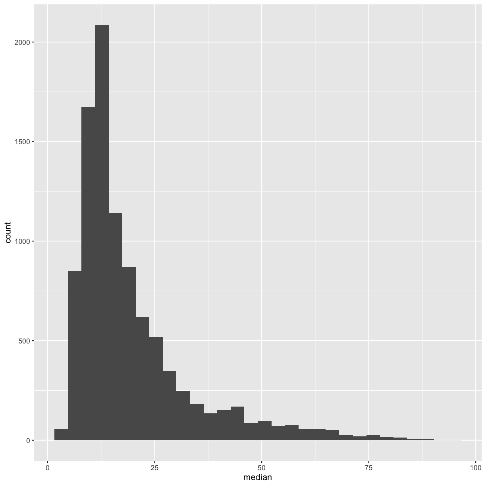

---
# Please do not edit this file directly; it is auto generated.
# Instead, please edit 03-r-data-analysis.md in _episodes_rmd/
title: "R for Data Analysis"
source: Rmd
teaching: 75
exercises: 15
questions:
- "How can I summarize my data in R?"
- "How can R help make my research more reproducible?"
objectives:
- "To become familiar with the functions of the `dplyr` and `tidyr` packages."
- "To be able to create plots and summary tables to answer analysis questions."
keypoints:
- "Package loading is an important first step in preparing an R environment."
- "There are many useful functions in the `tidyverse` packages that can aid in data analysis."
---

### Contents

1.  [Plotting review](#plotting-review)
1.  [Getting started](#getting-started)
    -   [Loading in the data](#loading-in-the-data)
1.  [An introduction to data analysis in R using `dplyr`](#intro-data-analysis)
    -   [Get stats fast with `summarize()`](#get-stats-fast-with-summarize)
    -   [Narrow down rows with `filter()`](#narrow-down-rows-with-filter)
    -   [Grouping rows using `group_by()`](#grouping-rows-using-group_by)
    -   [Make new variables with `mutate()`](#make-new-variables-with-mutate)
    -   [Subset columns using `select()`](#subset-columns-using-select)
    -   [Changing the shape of the data](#changing-the-shape-of-the-data)
1. [Applying it to your own data](#applying-it-to-your-own-data)

# Plotting review

First, navigate to the un-reports directory however you'd like and open `un-report.Rproj`.
This should open the un-report R project in RStudio.
You can check this by seeing if the Files in the bottom right of RStudio are the ones in your `un-report` directory.

The very first step is to read in the gapminder dataset, so do that first! Also load the `tidyverse` package.

> ## Solution
> 
> ~~~
> library(tidyverse)
> ~~~
> {: .language-r}
> 
> 
> 
> ~~~
> ── Attaching packages ─────────────────────────────────────────────────────────────────────────────────────────────────────────── tidyverse 1.3.1 ──
> ~~~
> {: .output}
> 
> 
> 
> ~~~
> ✔ ggplot2 3.3.6     ✔ purrr   0.3.4
> ✔ tibble  3.1.7     ✔ dplyr   1.0.9
> ✔ tidyr   1.2.0     ✔ stringr 1.4.0
> ✔ readr   2.1.2     ✔ forcats 0.5.1
> ~~~
> {: .output}
> 
> 
> 
> ~~~
> Warning: package 'ggplot2' was built under R version 4.1.2
> ~~~
> {: .warning}
> 
> 
> 
> ~~~
> Warning: package 'tibble' was built under R version 4.1.2
> ~~~
> {: .warning}
> 
> 
> 
> ~~~
> Warning: package 'tidyr' was built under R version 4.1.2
> ~~~
> {: .warning}
> 
> 
> 
> ~~~
> Warning: package 'readr' was built under R version 4.1.2
> ~~~
> {: .warning}
> 
> 
> 
> ~~~
> Warning: package 'dplyr' was built under R version 4.1.2
> ~~~
> {: .warning}
> 
> 
> 
> ~~~
> ── Conflicts ────────────────────────────────────────────────────────────────────────────────────────────────────────────── tidyverse_conflicts() ──
> ✖ dplyr::filter() masks stats::filter()
> ✖ dplyr::lag()    masks stats::lag()
> ~~~
> {: .output}
> 
> 
> 
> ~~~
> gapminder <- read_csv('data/gapminder_data.csv')
> ~~~
> {: .language-r}
> 
> 
> 
> ~~~
> Rows: 1704 Columns: 6
> ~~~
> {: .output}
> 
> 
> 
> ~~~
> ── Column specification ────────────────────────────────────────────────────────────────────────────────────────────────────────────────────────────
> Delimiter: ","
> chr (2): country, continent
> dbl (4): year, pop, lifeExp, gdpPercap
> 
> ℹ Use `spec()` to retrieve the full column specification for this data.
> ℹ Specify the column types or set `show_col_types = FALSE` to quiet this message.
> ~~~
> {: .output}
{: .solution}
#### Investigating population over time.
_[Back to top](#contents)_

Next, make a scatter plot of year vs. population, separated into a plot for each contient. Feel free to look back at the content from yesterday if you want!

> ## Solution
> 
> ~~~
> ggplot(gapminder, aes(x=year,y=pop)) +
> geom_point() +
> facet_wrap(vars(continent))
> ~~~
> {: .language-r}
> 
> 
{: .solution}

It seems like there are a couple outliers. By the end of today, we'll be able to identify what countries those are and how to exclude them from the plot. 

# Getting Started
_[Back to top](#contents)_

Yesterday we spent a lot of time making plots in R using the ggplot2 package. Visualizing data using plots is a very powerful skill in R, but what if we would like to work with only a subset of our data? Or clean up messy data, calculate summary statistics, create a new variable, or join two datasets together? There are several different methods for doing this in R, and we will touch on a few today using functions the `dplyr` package.

First, we will create a new R Script file for our work. Open RStudio. Choose "File" \> "New File" \> "RScript". We will save this file as `un_data_analysis.R`

### Loading in the data

We will start by importing the complete gapminder dataset that we used yesterday into our fresh new R session. Yesterday we did this using a "point-and-click" commands. Today let's type them into the console ourselves: `gapminder_data <- read_csv("data/gapminder_data.csv")`

> ## Exercise
>
> If we look in the console now, we'll see we've received an error message saying that R "could not find the function `read_csv()`". *Hint: Packages...*
>
> > ## Solution
> >
> > What this means is that R cannot find the function we are trying to call. The reason for this usually is that we are trying to run a function from a package that we have not yet loaded. This is a very common error message that you will probably see a lot when using R. It's important to remember that you will need to load any packages you want to use into R each time you start a new session. The `read_csv` function comes from the `readr` package which is included in the `tidyverse` package so we will just load the `tidyverse` package and run the import code again.
> {: .solution}
{: .challenge}

Now that we know what's wrong, We will use the `read_csv()` function from the Tidyverse `readr` package. Load the `tidyverse` package and gapminder dataset using the code below.

~~~
library(tidyverse)
~~~
{: .language-r}

The output in your console shows that by doing this, we attach several useful packages for data wrangling, including `readr`. Check out these packages and their documentation at [tidyverse.org](https://www.tidyverse.org)

> **Reminder:** Many of these packages, including `dplyr` , come with "Cheatsheets" found under the **Help** RStudio menu tab.

Reload your data:

~~~
gapminder_data <- read_csv("data/gapminder_data.csv")
~~~
{: .language-r}

~~~
Rows: 1704 Columns: 6
── Column specification ────────────────────────────────────────────────────────────────────────────────────────────────────────────────────────────
Delimiter: ","
chr (2): country, continent
dbl (4): year, pop, lifeExp, gdpPercap

ℹ Use `spec()` to retrieve the full column specification for this data.
ℹ Specify the column types or set `show_col_types = FALSE` to quiet this message.
~~~
{: .output}

Notice that the output of the `read_csv()` function is pretty informative. It tells us the name of all of our column headers as well as how it interpreted the data type. This birds-eye-view can help you take a quick look that everything is how we expect it to be.

Now we have the tools necessary to work through this lesson.

# An introduction to data analysis in R using `dplyr` {#intro-data-analysis}

## Get stats fast with `summarize()` {#get-stats-fast-with-summarize}

[*Back to top*](#contents)

Let's say we would like to know what is the mean (average) life expecteny in the dataset. R has a built in function function called `mean()` that will calculate this value for us. We can apply that function to our lifeExp column using the `summarize()` function. Here's what that looks like:

~~~
summarize(gapminder_data, averageLifeExp=mean(lifeExp))
~~~
{: .language-r}

~~~
# A tibble: 1 × 1
  averageLifeExp
           <dbl>
1           59.5
~~~
{: .output}

When we call `summarize()`, we can use any of the column names of our data object as values to pass to other functions. `summarize()` will return a new data object and our value will be returned as a column.

> **Note:** The `summarize()` and `summarise()` perform identical functions.

We name this new column so we can use in a future argument. So the `averageLifeExp=` part tells `summarize()` to use "averageLifeExp" as the name of the new column. Note that you don't have to quotes around this new name as long as it starts with a letter and doesn't include a space.

Instead of including the data as an argument, we can use the *pipe operator* `%>%` to pass the data value into the `summarize` function. 

~~~
gapminder_data %>% summarize(averageLifeExp=mean(lifeExp))
~~~
{: .language-r}

~~~
# A tibble: 1 × 1
  averageLifeExp
           <dbl>
1           59.5
~~~
{: .output}
 
This line of code will do the exact same thing as our first summary command, but the piping function tells R to use the `gapminder_data` dataframe as the first argument in the next function.

This lets us "chain" together multiple functions, which will be helpful later. Note that the pipe (`%>%`) is a bit different from using the ggplot plus (`+`). Pipes take the output from the left side and use it as input to the right side. Plusses layer on additional information (right side) to a preexisting plot (left side). 
 
We can also add an <kdb>Enter</kdb> to make it look nicer:  

~~~
gapminder_data %>%
  summarize(averageLifeExp=mean(lifeExp))
~~~
{: .language-r}

~~~
# A tibble: 1 × 1
  averageLifeExp
           <dbl>
1           59.5
~~~
{: .output}

Using the *pipe operator* `%>%` and enter command makes our code more readable. The  *pipe operator* `%>%` also helps to avoid using nested function and minimizes the need for new variables.

Since we use the pipe operator so often, there is a keyboard shortcut for it in RStudio. You can press <kdb>Ctrl</kdb>+<kdb>Shift</kdb>+<kdb>M<kdb> on Windows or <kdb>Cmd<kdb>+<kdb>Shift<kdb>+<kdb>M<kdb> on a Mac.

> ## Pro tip: Saving a new dataframe
> Notice that when we run the following code, we are not actually saving a new variable: 
> 
> ~~~
> gapminder_data %>%
>   summarize(averageLifeExp=mean(lifeExp))
> ~~~
> {: .language-r}
> This simply outputs what we have created, but does not change actually change `gapminder_data` or save a new dataframe. To save a new dataframe, we could run: 
> 
> ~~~
> gapminder_data_summarized <- gapminder_data %>%
>   summarize(averageLifeExp=mean(lifeExp))
> ~~~
> {: .language-r}
> Or if we want to change `gapminder_data` itself: 
> 
> ~~~
> gapminder_data <- gapminder_data %>%
>   summarize(averageLifeExp=mean(lifeExp))
> ~~~
> {: .language-r}
> IMPORTANT: This would overwrite the existing `gapminder_data` object. 
> 
> For now, we will not be saving dataframes, since we are just experimenting with `dplyr` functions, but it will be useful later on in this lesson. 
> 
{: .callout}

## Narrow down rows with `filter()` {#narrow-down-rows-with-filter}

[*Back to top*](#contents)

Let's take a look at the value we just calculated, which tells us the average life expectancy for all rows in the data was 59.5. That seems a bit low, doesn't it? What's going on?

Well, remember the dataset contains rows from many different years and many different countries. It's likely that life expectancy has increased overtime, so it may not make sense to average over all the years at the same time.

Use `summarize()` to find the most recent year in the data set. We can use the `max()` function to return the maximum value.

> ## Practice using the `%>%` to summarize data
>
> Find the most recent year using the piping function.
>
> > ## Solution:
> >
> > 
> > ~~~
> > gapminder_data %>%  
> >  summarize(recent_year = max(year))
> > ~~~
> > {: .language-r}
> > 
> > 
> > 
> > ~~~
> > # A tibble: 1 × 1
> >   recent_year
> >         <dbl>
> > 1        2007
> > ~~~
> > {: .output}
> > 
> {: .solution}
{: .challenge}

So we see that the most recent year in the dataset is 2007. Let's calculate the life expectancy for all countries for only that year. To do that, we will use the `filter()` function to only use rows for that year before calculating the mean value.

~~~
gapminder_data %>%
  filter(year == 2007) %>%
  summarize(average=mean(lifeExp))
~~~
{: .language-r}

~~~
# A tibble: 1 × 1
  average
    <dbl>
1    67.0
~~~
{: .output}

> ## Filtering the dataset
>
> What is the average GDP per capita for the first year in the dataset? *Hint: the column headers identified by `read_csv()` showed us there was a column called gdpPercap in the dataset*
>
> > ## Solution
> >
> > Identify the earliest year in our dataset using `min()` and `summarize()`
> >
> > 
> > ~~~
> > gapminder_data %>%
> > summarize(first_year=min(year))
> > ~~~
> > {: .language-r}
> > 
> > 
> > 
> > ~~~
> > # A tibble: 1 × 1
> >   first_year
> >        <dbl>
> > 1       1952
> > ~~~
> > {: .output}
> >
> > We see here that the first year in the dataset is 1952. Filter to only 1952, and determin the average GDP per capita.
> >
> > 
> > ~~~
> > gapminder_data %>%
> > filter(year == 1952) %>%
> > summarize(average_gdp=mean(gdpPercap))
> > ~~~
> > {: .language-r}
> > 
> > 
> > 
> > ~~~
> > # A tibble: 1 × 1
> >   average_gdp
> >         <dbl>
> > 1       3725.
> > ~~~
> > {: .output}
> > {: .source}
> > By combining `filter()` and `summarize()` we were able to calculate the mean GDP per capita in the year 1952.
> {: .solution}
{: .challenge}

Notice how the pipe operator (`%>%`) allows us to combine these two simple steps into a more complicated data extraction?. We took the data, filtered out the rows, then took the mean value. The argument we pass to `filter()` needs to be some expression that will return TRUE or FALSE. We can use comparisons like `>` (greater than) and `<` (less than) for example. Here we tested for equality using a double equals sign `==`. You use `==` (double equals) when testing if two values are equal, and you use `=` (single equals) when naming arguments that you are passing to functions. Try changing it to use `filter(year = 2007)` and see what happens.

## Grouping rows using `group_by()` {#grouping-rows-using-group_by}

[*Back to top*](#contents)

We see that the life expectancy in 2007 is much larger than the value we got using all of the rows. It seems life expectancy is increasing which is good news. But now we might be interested in calculating the average for each year. Rather that doing a bunch of different `filter()` statements, we can instead use the `group_by()` function. The function allows us to tell the code to treat the rows in logical groups, so rather than summarizing over all the rows, we will get one summary value for each group. Here's what that will look like:

~~~
gapminder_data %>%
  group_by(year) %>%
  summarize(average=mean(lifeExp))
~~~
{: .language-r}

~~~
# A tibble: 12 × 2
    year average
   <dbl>   <dbl>
 1  1952    49.1
 2  1957    51.5
 3  1962    53.6
 4  1967    55.7
 5  1972    57.6
 6  1977    59.6
 7  1982    61.5
 8  1987    63.2
 9  1992    64.2
10  1997    65.0
11  2002    65.7
12  2007    67.0
~~~
{: .output}

The `group_by()` function expects you to pass in the name of a column (or multiple columns separated by comma) in your data. 

Note that you might get a message about the summarize function regrouping the output by 'year'. This simply indicates what the function is grouping by. 

> ## Grouping the data
>
> Try calculating the average life expectancy by continent.
>
> > ## Solution
> >
> > 
> > ~~~
> > gapminder_data %>%
> > group_by(continent) %>%
> > summarize(average=mean(lifeExp))
> > ~~~
> > {: .language-r}
> > 
> > 
> > 
> > ~~~
> > # A tibble: 5 × 2
> >   continent average
> >   <chr>       <dbl>
> > 1 Africa       48.9
> > 2 Americas     64.7
> > 3 Asia         60.1
> > 4 Europe       71.9
> > 5 Oceania      74.3
> > ~~~
> > {: .output}
> > {: .source}
> >
> > By combining `group_by()` and `summarize()` we are able to calculate the mean life expectancy by continent.
> {: .solution}
{: .challenge}

You can also create more than one new column when you call `summarize()`. To do so, you must separate your columns with a comma. Building on the code from the last exercise, let's add a new column that calculates the minimum life expectancy for each continent. 

~~~
gapminder_data %>%
  group_by(continent) %>%
  summarize(average=mean(lifeExp), min=min(lifeExp))
~~~
{: .language-r}

~~~
# A tibble: 5 × 3
  continent average   min
  <chr>       <dbl> <dbl>
1 Africa       48.9  23.6
2 Americas     64.7  37.6
3 Asia         60.1  28.8
4 Europe       71.9  43.6
5 Oceania      74.3  69.1
~~~
{: .output}

## Make new variables with `mutate()` {#make-new-variables-with-mutate}

[*Back to top*](#contents)

Each time we ran `summarize()`, we got back fewer rows than passed in. We either got one row back, or one row per group. But sometimes we want to create a new column in our data without changing the number of rows. The function we use to create new columns is called `mutate()`.

We have a column for the population and the GDP per capita. If we wanted to get the total GDP, we could multiply the per capita GDP values by the total population. Here's what such a `mutate()` command would look like:

~~~
gapminder_data %>%
  mutate(gdp = pop * gdpPercap)
~~~
{: .language-r}

~~~
# A tibble: 1,704 × 7
   country      year      pop continent lifeExp gdpPercap          gdp
   <chr>       <dbl>    <dbl> <chr>       <dbl>     <dbl>        <dbl>
 1 Afghanistan  1952  8425333 Asia         28.8      779.  6567086330.
 2 Afghanistan  1957  9240934 Asia         30.3      821.  7585448670.
 3 Afghanistan  1962 10267083 Asia         32.0      853.  8758855797.
 4 Afghanistan  1967 11537966 Asia         34.0      836.  9648014150.
 5 Afghanistan  1972 13079460 Asia         36.1      740.  9678553274.
 6 Afghanistan  1977 14880372 Asia         38.4      786. 11697659231.
 7 Afghanistan  1982 12881816 Asia         39.9      978. 12598563401.
 8 Afghanistan  1987 13867957 Asia         40.8      852. 11820990309.
 9 Afghanistan  1992 16317921 Asia         41.7      649. 10595901589.
10 Afghanistan  1997 22227415 Asia         41.8      635. 14121995875.
# … with 1,694 more rows
~~~
{: .output}

This will add a new column called "gdp" to our data. We use the column names as if they were regular values that we want to perform mathematical operations on and provide the name in front of an equals sign like we have done with `summarize()`

> ## `mutate()`
> We can also multiply by constants or other numbers using mutate - remember how in the plotting lesson we made a plot with population in millions? Try making a new column for this dataframe called popInMillions that is the population in million. 
> 
> > ## Solution: 
> > 
> > ~~~
> > gapminder_data %>%  
> > mutate(gdp = pop * gdpPercap, popInMillions = pop / 1000000)  
> > ~~~
> > {: .language-r}
> > 
> > 
> > 
> > ~~~
> > # A tibble: 1,704 × 8
> >    country      year      pop continent lifeExp gdpPercap      gdp popInMillions
> >    <chr>       <dbl>    <dbl> <chr>       <dbl>     <dbl>    <dbl>         <dbl>
> >  1 Afghanistan  1952  8425333 Asia         28.8      779.  6.57e 9          8.43
> >  2 Afghanistan  1957  9240934 Asia         30.3      821.  7.59e 9          9.24
> >  3 Afghanistan  1962 10267083 Asia         32.0      853.  8.76e 9         10.3 
> >  4 Afghanistan  1967 11537966 Asia         34.0      836.  9.65e 9         11.5 
> >  5 Afghanistan  1972 13079460 Asia         36.1      740.  9.68e 9         13.1 
> >  6 Afghanistan  1977 14880372 Asia         38.4      786.  1.17e10         14.9 
> >  7 Afghanistan  1982 12881816 Asia         39.9      978.  1.26e10         12.9 
> >  8 Afghanistan  1987 13867957 Asia         40.8      852.  1.18e10         13.9 
> >  9 Afghanistan  1992 16317921 Asia         41.7      649.  1.06e10         16.3 
> > 10 Afghanistan  1997 22227415 Asia         41.8      635.  1.41e10         22.2 
> > # … with 1,694 more rows
> > ~~~
> > {: .output}
> {: .solution}
{: .challenge}
 

## Subset columns using `select()` {#subset-columns-using-select}

[*Back to top*](#contents)

We use the `filter()` function to choose a subset of the rows from our data, but when we want to choose a subset of columns from our data we use `select()`. For example, if we only wanted to see the population ("pop") and year values, we can do:

~~~
gapminder_data %>%
  select(pop, year)
~~~
{: .language-r}

~~~
# A tibble: 1,704 × 2
        pop  year
      <dbl> <dbl>
 1  8425333  1952
 2  9240934  1957
 3 10267083  1962
 4 11537966  1967
 5 13079460  1972
 6 14880372  1977
 7 12881816  1982
 8 13867957  1987
 9 16317921  1992
10 22227415  1997
# … with 1,694 more rows
~~~
{: .output}

We can also use `select()` to drop/remove particular columns by putting a minus sign (`-`) in front of the column name. For example, if we want everything but the continent column, we can do:

~~~
gapminder_data %>%
  select(-continent)
~~~
{: .language-r}

~~~
# A tibble: 1,704 × 5
   country      year      pop lifeExp gdpPercap
   <chr>       <dbl>    <dbl>   <dbl>     <dbl>
 1 Afghanistan  1952  8425333    28.8      779.
 2 Afghanistan  1957  9240934    30.3      821.
 3 Afghanistan  1962 10267083    32.0      853.
 4 Afghanistan  1967 11537966    34.0      836.
 5 Afghanistan  1972 13079460    36.1      740.
 6 Afghanistan  1977 14880372    38.4      786.
 7 Afghanistan  1982 12881816    39.9      978.
 8 Afghanistan  1987 13867957    40.8      852.
 9 Afghanistan  1992 16317921    41.7      649.
10 Afghanistan  1997 22227415    41.8      635.
# … with 1,694 more rows
~~~
{: .output}

> ## selecting columns 
> Create a dataframe with only the `country`, `continent`, `year`, and `lifeExp` columns. 
> 
> > ## Solution: 
> > There are multiple ways to do this exercise. Here are two different possibilities. 
> > 
> > 
> > ~~~
> > gapminder_data %>%
> >   select(country, continent, year, lifeExp)
> > ~~~
> > {: .language-r}
> > 
> > 
> > 
> > ~~~
> > # A tibble: 1,704 × 4
> >    country     continent  year lifeExp
> >    <chr>       <chr>     <dbl>   <dbl>
> >  1 Afghanistan Asia       1952    28.8
> >  2 Afghanistan Asia       1957    30.3
> >  3 Afghanistan Asia       1962    32.0
> >  4 Afghanistan Asia       1967    34.0
> >  5 Afghanistan Asia       1972    36.1
> >  6 Afghanistan Asia       1977    38.4
> >  7 Afghanistan Asia       1982    39.9
> >  8 Afghanistan Asia       1987    40.8
> >  9 Afghanistan Asia       1992    41.7
> > 10 Afghanistan Asia       1997    41.8
> > # … with 1,694 more rows
> > ~~~
> > {: .output}
> > 
> > ~~~
> > gapminder_data %>%
> >   select(-pop, -gdpPercap)
> > ~~~
> > {: .language-r}
> > 
> > 
> > 
> > ~~~
> > # A tibble: 1,704 × 4
> >    country      year continent lifeExp
> >    <chr>       <dbl> <chr>       <dbl>
> >  1 Afghanistan  1952 Asia         28.8
> >  2 Afghanistan  1957 Asia         30.3
> >  3 Afghanistan  1962 Asia         32.0
> >  4 Afghanistan  1967 Asia         34.0
> >  5 Afghanistan  1972 Asia         36.1
> >  6 Afghanistan  1977 Asia         38.4
> >  7 Afghanistan  1982 Asia         39.9
> >  8 Afghanistan  1987 Asia         40.8
> >  9 Afghanistan  1992 Asia         41.7
> > 10 Afghanistan  1997 Asia         41.8
> > # … with 1,694 more rows
> > ~~~
> > {: .output}
> {: .solution}
{: .challenge}

> ## Bonus: Using helper functions with `select()`
>
> The `select()` function has a bunch of helper functions that are handy if you are working with a dataset that has a lot of columns. You can see these helper functions on the `?select` help page. For example, let's say we wanted to select the year column and all the columns that start with the letter "c". You can do that with:
> 
> 
> ~~~
> gapminder_data %>%
>   select(year, starts_with("c"))
> ~~~
> {: .language-r}
> 
> 
> 
> ~~~
> # A tibble: 1,704 × 3
>     year country     continent
>    <dbl> <chr>       <chr>    
>  1  1952 Afghanistan Asia     
>  2  1957 Afghanistan Asia     
>  3  1962 Afghanistan Asia     
>  4  1967 Afghanistan Asia     
>  5  1972 Afghanistan Asia     
>  6  1977 Afghanistan Asia     
>  7  1982 Afghanistan Asia     
>  8  1987 Afghanistan Asia     
>  9  1992 Afghanistan Asia     
> 10  1997 Afghanistan Asia     
> # … with 1,694 more rows
> ~~~
> {: .output}
> This returns just the three columns we are interested in. 
>
> > ## Using `select()` with a helper function
> >
> > Find a helper function on the help page that will choose all the columns that have "p" as their last letter (ie: "pop","lifeExp","gdpPerCap")
> >
> > > ## Solution
> > >
> > > The helper function `ends_with()` can help us here.
> > >
> > > 
> > > ~~~
> > > gapminder_data %>%
> > > select(ends_with("p"))
> > > ~~~
> > > {: .language-r}
> > > 
> > > 
> > > 
> > > ~~~
> > > # A tibble: 1,704 × 3
> > >         pop lifeExp gdpPercap
> > >       <dbl>   <dbl>     <dbl>
> > >  1  8425333    28.8      779.
> > >  2  9240934    30.3      821.
> > >  3 10267083    32.0      853.
> > >  4 11537966    34.0      836.
> > >  5 13079460    36.1      740.
> > >  6 14880372    38.4      786.
> > >  7 12881816    39.9      978.
> > >  8 13867957    40.8      852.
> > >  9 16317921    41.7      649.
> > > 10 22227415    41.8      635.
> > > # … with 1,694 more rows
> > > ~~~
> > > {: .output}
> > {: .solution}
> {: .challenge}
> 
{: .solution}

## Changing the shape of the data

[*Back to top*](#contents)

Data comes in many shapes and sizes, and one way we classify data is either "wide" or "long." Data that is "long" has one row per observation. The gapminder_data data is in a long format. We have one row for each country for each year and each different measurement for that country is in a different column. We might describe this data as "tidy" because it makes it easy to work with `ggplot2` and `dplyr` functions (this is where the "tidy" in "tidyverse" comes from). As tidy as it may be, sometimes we may want our data in a "wide" format. Typically in "wide" format each row represents a group of observations and each value is placed in a different column rather than a different row. For example maybe we want only one row per country and want to spread the life expectancy values into different columns (one for each year).

The `tidyr` package contains the functions `pivot_wider` and `pivot_longer` that make it easy to switch between the two formats. The `tidyr` package is included in the `tidyverse` package so we don't need to do anything to load it.

~~~
gapminder_data %>%
  select(country, continent, year, lifeExp) %>%
  pivot_wider(names_from = year, values_from = lifeExp )
~~~
{: .language-r}

~~~
# A tibble: 142 × 14
   country     continent `1952` `1957` `1962` `1967` `1972` `1977` `1982` `1987`
   <chr>       <chr>      <dbl>  <dbl>  <dbl>  <dbl>  <dbl>  <dbl>  <dbl>  <dbl>
 1 Afghanistan Asia        28.8   30.3   32.0   34.0   36.1   38.4   39.9   40.8
 2 Albania     Europe      55.2   59.3   64.8   66.2   67.7   68.9   70.4   72  
 3 Algeria     Africa      43.1   45.7   48.3   51.4   54.5   58.0   61.4   65.8
 4 Angola      Africa      30.0   32.0   34     36.0   37.9   39.5   39.9   39.9
 5 Argentina   Americas    62.5   64.4   65.1   65.6   67.1   68.5   69.9   70.8
 6 Australia   Oceania     69.1   70.3   70.9   71.1   71.9   73.5   74.7   76.3
 7 Austria     Europe      66.8   67.5   69.5   70.1   70.6   72.2   73.2   74.9
 8 Bahrain     Asia        50.9   53.8   56.9   59.9   63.3   65.6   69.1   70.8
 9 Bangladesh  Asia        37.5   39.3   41.2   43.5   45.3   46.9   50.0   52.8
10 Belgium     Europe      68     69.2   70.2   70.9   71.4   72.8   73.9   75.4
# … with 132 more rows, and 4 more variables: `1992` <dbl>, `1997` <dbl>,
#   `2002` <dbl>, `2007` <dbl>
~~~
{: .output}

Notice here that we tell `pivot_wider()` which columns to pull the names we wish our new columns to be named from the year variable, and the values to populate those columns from the lifeExp variable. (Again, neither of which have to be in quotes in the code when there are no special characters or spaces - certainly an incentive not to use special characters or spaces!) We see that the resulting table has new columns by year, and the values populate it with our remaining variables dictating the rows.

Before we move on to more data cleaning, let's create the final gapminder dataframe we will be working with for the rest of the lesson! 

> ## Final Americas 2007 gapminder dataset
> Read in the `gapminder_data.csv` file, filter out the year 2007 and the continent "Americas." Then drop the `year` and `continent` columns from the dataframe. Then save the new dataframe into a variable called `gapminder_data_2007`. 
> 
> > ## Solution: 
> > 
> > ~~~
> > gapminder_data_2007 <- read_csv("data/gapminder_data.csv") %>%
> >   filter(year == 2007 & continent == "Americas") %>%
> >   select(-year, -continent)
> > ~~~
> > {: .language-r}
> > 
> > 
> > 
> > ~~~
> > Rows: 1704 Columns: 6
> > ── Column specification ────────────────────────────────────────────────────────────────────────────────────────────────────────────────────────────
> > Delimiter: ","
> > chr (2): country, continent
> > dbl (4): year, pop, lifeExp, gdpPercap
> > 
> > ℹ Use `spec()` to retrieve the full column specification for this data.
> > ℹ Specify the column types or set `show_col_types = FALSE` to quiet this message.
> > ~~~
> > {: .output}
> {: .solution}
{: .challenge}

Awesome! This is the dataframe we will be using later on in this lesson. 

# Applying it to your own data

Now it's time to read in, clean, and make plots with your own data! 
Use your ideas from your brainstorming session yesterday to help you get started, but feel free to branch out and explore other things as well.
Let us know if you have questions; we're here to help.

