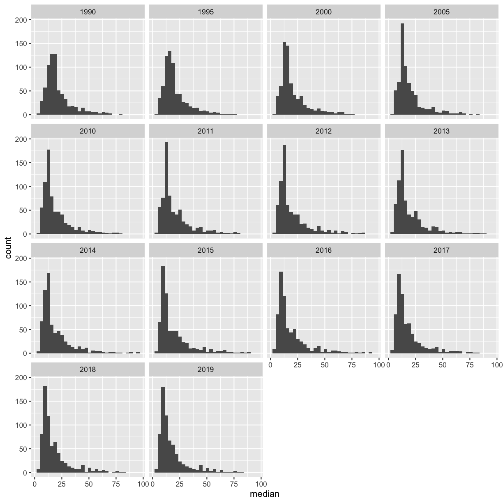

---
# Please do not edit this file directly; it is auto generated.
# Instead, please edit 03-r-data-analysis.md in _episodes_rmd/
title: "R for Data Analysis"
source: Rmd
teaching: 75
exercises: 15
questions:
- "How can I summarize my data in R?"
- "How can R help make my research more reproducible?"
objectives:
- "To become familiar with the functions of the `dplyr` and `tidyr` packages."
- "To be able to create plots and summary tables to answer analysis questions."
keypoints:
- "Package loading is an important first step in preparing an R environment."
- "There are many useful functions in the `tidyverse` packages that can aid in data analysis."
---

### Contents

1.  [Plotting review](#plotting-review)
1.  [Overview of the lesson](#overview-of-the-lesson)
1.  [An introduction to data analysis in R using `dplyr`](#intro-data-analysis)
    -   [Get stats fast with `summarize()`](#get-stats-fast-with-summarize)
    -   [Narrow down rows with `filter()`](#narrow-down-rows-with-filter)
    -   [Grouping rows using `group_by()`](#grouping-rows-using-group_by)
    -   [Make new variables with `mutate()`](#make-new-variables-with-mutate)
    -   [Subset columns using `select()`](#subset-columns-using-select)
    -   [Changing the shape of the data](#changing-the-shape-of-the-data)
1. [Applying it to your own data](#applying-it-to-your-own-data)

# Day 1 review

#### Opening your Rproject in RStudio.

First, navigate to the `un-reports` directory however you'd like and open `un-report.Rproj`.
This should open the un-report R project in RStudio.
You can check this by seeing if the Files in the bottom right of RStudio are the ones in your `un-report` directory. 

#### Creating a new R script.

Then create a new R Script file for our work. Open RStudio. Choose "File" \> "New File" \> "RScript". Save this file as `un_data_analysis.R`. 

#### Loading your data.

Start by importing the dataset that we used yesterday into our fresh new R session: `smoking <- read_csv('data/smoking_cancer_1990.csv')`.

What error do you get and why? Fix the code so you don't get an error and read in the dataset.

> ## Solution
>
> If we look in the console now, we'll see we've received an error message saying that R "could not find the function `read_csv()`". *Hint: Packages...*
> What this means is that R cannot find the function we are trying to call. The reason for this usually is that we are trying to run a function from a package that we have not yet loaded. This is a very common error message that you will probably see a lot when using R. It's important to remember that you will need to load any packages you want to use into R each time you start a new session. The `read_csv` function comes from the `readr` package which is included in the `tidyverse` package so we will just load the `tidyverse` package and run the import code again:
> 
> ~~~
> library(tidyverse)
> ~~~
> {: .language-r}
> 
> 
> 
> ~~~
> ── Attaching packages ─────────────────────────────────────── tidyverse 1.3.1 ──
> ~~~
> {: .output}
> 
> 
> 
> ~~~
> ✔ ggplot2 3.3.6     ✔ purrr   0.3.4
> ✔ tibble  3.1.7     ✔ dplyr   1.0.9
> ✔ tidyr   1.2.0     ✔ stringr 1.4.0
> ✔ readr   2.1.2     ✔ forcats 0.5.1
> ~~~
> {: .output}
> 
> 
> 
> ~~~
> ── Conflicts ────────────────────────────────────────── tidyverse_conflicts() ──
> ✖ dplyr::filter() masks stats::filter()
> ✖ dplyr::lag()    masks stats::lag()
> ~~~
> {: .output}
> 
> 
> 
> ~~~
> smoking_1990 <- read_csv('data/smoking_cancer_1990.csv')
> ~~~
> {: .language-r}
> 
> 
> 
> ~~~
> Rows: 192 Columns: 5
> ~~~
> {: .output}
> 
> 
> 
> ~~~
> ── Column specification ────────────────────────────────────────────────────────
> Delimiter: ","
> chr (2): country, continent
> dbl (3): pop, smoke_pct, lung_cancer_pct
> 
> ℹ Use `spec()` to retrieve the full column specification for this data.
> ℹ Specify the column types or set `show_col_types = FALSE` to quiet this message.
> ~~~
> {: .output}
> As we saw yesterday, the output in your console shows that by doing this, we attach several useful packages for data wrangling, including `readr`. Check out these packages and their documentation at [tidyverse.org](https://www.tidyverse.org). 
> 
> **Reminder:** Many of these packages, including `dplyr` , come with "Cheatsheets" found under the **Help** RStudio menu tab.
{: .solution}

#### Investigating population by continent.
_[Back to top](#contents)_

Next, make plot comparing the population of countries on different continents. Feel free to look back at the content from yesterday if you want!

Bonus 1: Change the y axis to a log10 scale so that you can see the spread in the data a bit better. 

Bonus 2: Make the plot prettier by changing the axis labels, theme, and anything else you want. Feel free to look back at the material from yesterday and/or use the Internet to help. 

> ## Solution
> 
> ~~~
> ggplot(smoking_1990) +
>   aes(x = continent, y = pop) +
>   geom_boxplot()
> ~~~
> {: .language-r}
> 
> 
> Bonus 1: 
> 
> ~~~
> ggplot(smoking_1990) +
>   aes(x = continent, y = pop) +
>   geom_boxplot() +
> scale_y_log10()
> ~~~
> {: .language-r}
> 
> 
> Bonus 2 example:
> 
> ~~~
> ggplot(smoking_1990) +
>   aes(x = continent, y = pop) +
>   geom_boxplot() +
> scale_y_log10() +
> labs(x = 'Continent', y = 'Population') +
> theme_bw()
> ~~~
> {: .language-r}
> 
> 
{: .solution}

It seems like there are a couple outliers. By the end of today, we'll be able to identify what countries those are. 

# Overview of the lesson
_[Back to top](#contents)_

Yesterday we spent a lot of time making plots in R using the ggplot2 package. Visualizing data using plots is a very powerful skill in R, but what if we would like to work with only a subset of our data? Or clean up messy data, calculate summary statistics, create a new variable, or join two datasets together? There are several different methods for doing this in R, and we will touch on a few today using functions the `dplyr` package, which is also part of the `tidyverse`.

# An introduction to data analysis in R using `dplyr` {#intro-data-analysis}

First, we're going to read in a dataset with data for multiple years:

~~~
smoking <- read_csv('data/smoking_cancer.csv')
~~~
{: .language-r}

~~~
Rows: 5749 Columns: 6
── Column specification ────────────────────────────────────────────────────────
Delimiter: ","
chr (2): country, continent
dbl (4): year, pop, smoke_pct, lung_cancer_pct

ℹ Use `spec()` to retrieve the full column specification for this data.
ℹ Specify the column types or set `show_col_types = FALSE` to quiet this message.
~~~
{: .output}

## Get stats fast with `summarize()` {#get-stats-fast-with-summarize}
[*Back to top*](#contents)

Let's say we would like to know the mean (average) smoking rate in the dataset. R has a built in function function called `mean()` that will calculate this value for us. We can apply that function to our smoking_pct column using the `summarize()` function. Here's what that looks like:

~~~
summarize(smoking, mean_smoke_pct=mean(smoke_pct))
~~~
{: .language-r}

~~~
# A tibble: 1 × 1
  mean_smoke_pct
           <dbl>
1           21.7
~~~
{: .output}

When we call `summarize()`, we can use any of the column names of our data object as values to pass to other functions. `summarize()` will return a new data object and our value will be returned as a column.

> **Note:** The `summarize()` and `summarise()` functions perform identical functions.

The `mean_smoke_pct=` part tells `summarize()` to use "mean_smoke_pct" as the name of the new column. Note that you don't have to have quotes around this new name as long as it starts with a letter and doesn't include a space.

Instead of including the data object as an argument, we can use the *pipe operator* `%>%` to pass the data value into the `summarize` function. You can think of `%>%` as another way to type "and then."

~~~
smoking %>% summarize(mean_smoke_pct=mean(smoke_pct))
~~~
{: .language-r}

~~~
# A tibble: 1 × 1
  mean_smoke_pct
           <dbl>
1           21.7
~~~
{: .output}
 
This line of code will do the exact same thing as our first summary command, but the piping function tells R to use the `smoking` dataframe as the first argument in the next function.

This lets us "chain" together multiple functions, which will be helpful later. Note that the pipe (`%>%`) is a bit different from using the ggplot plus (`+`). Pipes take the output from the left side and use it as input to the right side. In other words, it tells R to do the function on the left *and then* the function on the right. In contrast, plusses layer on additional information (right side) to a preexisting plot (left side). 
 
We can also add an <kbd>Enter</kbd> to make it look nicer:  

~~~
smoking %>%
  summarize(mean_smoke_pct=mean(smoke_pct))
~~~
{: .language-r}

~~~
# A tibble: 1 × 1
  mean_smoke_pct
           <dbl>
1           21.7
~~~
{: .output}

Using the *pipe operator* `%>%` and <kbd>Enter</kbd> makes our code more readable. The  *pipe operator* `%>%` also helps to avoid using nested functions and minimizes the need for new variables.

Since we use the pipe operator so often, there is a keyboard shortcut for it in RStudio. You can press <kbd>Ctrl</kbd>+<kbd>Shift</kbd>+<kbd>M</kbd> on Windows or <kbd>Cmd</kbd>+<kbd>Shift</kbd>+<kbd>M</kbd> on a Mac.

When you call `summarize()`, you can also create more than one new column. To do so, you must separate your columns with a comma. Building on the code from above, let's add a new column that calculates the minimum and maximum percent of smokers. 

~~~
smoking %>%
  summarize(mean_smoke_pct=mean(smoke_pct),
            min_smoke_pct=min(smoke_pct),
            max_smoke_pct=max(smoke_pct))
~~~
{: .language-r}

~~~
# A tibble: 1 × 3
  mean_smoke_pct min_smoke_pct max_smoke_pct
           <dbl>         <dbl>         <dbl>
1           21.7          3.06          52.1
~~~
{: .output}

> ## Pro tip: Saving a new dataframe
> Notice that when we run the following code, we are not actually saving a new variable: 
> 
> ~~~
> smoking %>%
>   summarize(mean_smoke_pct=mean(smoke_pct))
> ~~~
> {: .language-r}
> This simply outputs what we have created, but does not change actually change `smoking` dataset or save a new dataframe. To save a new dataframe, we could run: 
> 
> ~~~
> smoking_summarized <- smoking %>%
>   summarize(mean_smoke_pct=mean(smoke_pct))
> ~~~
> {: .language-r}
> Or if we want to change `smoking` itself (DON'T RUN THIS): 
> 
> ~~~
> smoking <- smoking %>%
>   summarize(mean_smoke_pct=mean(smoke_pct))
> ~~~
> {: .language-r}
> IMPORTANT: This would overwrite the existing `smoking` object. 
> 
> For now, we will not be saving dataframes, since we are just experimenting with `dplyr` functions, but it will be useful later on in this lesson. 
> 
{: .callout}

> ## Practice using the `%>%` to summarize data
>
> Use the piping function and `summarize()` to find the earliest year in the data set. HINT: the `min()` function returns the minimum value.
>
> > ## Solution:
> >
> > 
> > ~~~
> > smoking %>%  
> >   summarize(earliest_year = min(year))
> > ~~~
> > {: .language-r}
> > 
> > 
> > 
> > ~~~
> > # A tibble: 1 × 1
> >   earliest_year
> >           <dbl>
> > 1          1990
> > ~~~
> > {: .output}
> > 
> {: .solution}
{: .challenge}

## Narrow down rows with `filter()` {#narrow-down-rows-with-filter}
[*Back to top*](#contents)

Let's take a look at the value we just calculated, which tells us the average percent of smokers for all rows in the data was 21.7. But the dataset contains rows from many different years and many different countries. It's possible that the percent of smokers has changed overtime, so it may not make sense to average over all the years at the same time.

So we see that the earliest year in the dataset is 1990. Let's calculate the average percent of smokers for all countries for only that year. To do that, we will use the `filter()` function to only use rows for that year before calculating the mean value.

~~~
smoking %>%
  filter(year = 1990) %>%
  summarize(mean_smoke_pct_1990=mean(smoke_pct))
~~~
{: .language-r}

~~~
Error in `filter()`:
! We detected a named input.
ℹ This usually means that you've used `=` instead of `==`.
ℹ Did you mean `year == 1990`?
~~~
{: .error}

Oops! We got an error, but don't panic. Error messages are often pretty useful. 
In this case, it says that that we used `=` instead of `==`. 
That's because we use `=` (single equals) when naming arguments that you are passing to functions.
So here R thinks we're trying to assign 1990 to year, kind of like we do in the summarize function.
What we really want to do is find all of the years that are equal to 1990. 
To do this, we have to use `==` (double equals), which we use when testing if two values are equal to each other:

~~~
smoking %>%
  filter(year == 1990) %>%
  summarize(mean_smoke_pct_1990=mean(smoke_pct))
~~~
{: .language-r}

~~~
# A tibble: 1 × 1
  mean_smoke_pct_1990
                <dbl>
1                23.9
~~~
{: .output}

Notice how the pipe operator (`%>%`) allows us to combine these two simple steps into a more complicated data extraction? We took the data, filtered out the rows, then took the mean value. The argument we pass to `filter()` needs to be some expression that will return TRUE or FALSE. We can use comparisons like `>` (greater than) and `<` (less than) for example. Here we tested for equality using a double equals sign `==`. 

> ## Filtering the dataset
>
> What is the average percent of people with lung cancer for the most recent year in the dataset? *Hint: the column headers identified by `read_csv()` showed us there was a column called `lung_cancer_pct` in the dataset*
>
> Bonus: Figure out a way to write the code so you don't have to type the year into filter. 
> (Typing in the year is an example of hard-coding and we try to avoid it because if the data changes the number might also change.)
>
> > ## Solution
> >
> > Identify the most recent year in our dataset using `max()` and `summarize()`:
> >
> > 
> > ~~~
> > smoking %>%
> > summarize(recent_year=max(year))
> > ~~~
> > {: .language-r}
> > 
> > 
> > 
> > ~~~
> > # A tibble: 1 × 1
> >   recent_year
> >         <dbl>
> > 1        2019
> > ~~~
> > {: .output}
> >
> > Filter to only the maximum year, and determine the average percent of people with lung cancer.
> >
> > 
> > ~~~
> > smoking %>%
> > filter(year == 2019) %>%
> > summarize(mean_cancer_pct=mean(lung_cancer_pct))
> > ~~~
> > {: .language-r}
> > 
> > 
> > 
> > ~~~
> > # A tibble: 1 × 1
> >   mean_cancer_pct
> >             <dbl>
> > 1          0.0281
> > ~~~
> > {: .output}
> > {: .source}
> > By combining `filter()` and `summarize()` we were able to calculate the mean mercent of people with lung cancer in 2019
> > 
> > Bonus:
> > Instead of finding the most recent year first and then filtering, we can find the most recent year right in the filter function: 
> > 
> > ~~~
> > smoking %>% 
> > filter(year == max(year)) %>% 
> > summarize(mean_cancer_pct=mean(lung_cancer_pct))
> > ~~~
> > {: .language-r}
> > 
> > 
> > 
> > ~~~
> > # A tibble: 1 × 1
> >   mean_cancer_pct
> >             <dbl>
> > 1          0.0281
> > ~~~
> > {: .output}
> {: .solution}
{: .challenge}

## Grouping rows using `group_by()` {#grouping-rows-using-group_by}
[*Back to top*](#contents)

We previously saw that the mean percent of smokers is larger in 1990 than the value we got using all of the rows. But now we might be interested in calculating the average for each year. Rather that doing a bunch of different `filter()` statements, we can instead use the `group_by()` function. The function allows us to treat the rows in logical groups, so rather than summarizing over all the rows, we will get one summary value for each group. Here's what that will look like:

~~~
smoking %>%
  group_by(year) %>%
  summarize(average=mean(smoke_pct))
~~~
{: .language-r}

~~~
# A tibble: 30 × 2
    year average
   <dbl>   <dbl>
 1  1990    23.9
 2  1991    23.7
 3  1992    23.6
 4  1993    23.4
 5  1994    23.3
 6  1995    23.1
 7  1996    23.0
 8  1997    22.9
 9  1998    22.7
10  1999    22.6
# … with 20 more rows
~~~
{: .output}

The `group_by()` function expects you to pass in the name of a column (or multiple columns separated by commas) in your data. 

Note that you might get a message about the summarize function regrouping the output by 'year'. This simply indicates what the function is grouping by. 

We can also group by multiple variables. In this case, we separate the variables with commas:

~~~
smoking %>%
  group_by(year, continent) %>%
  summarize(average=mean(smoke_pct))
~~~
{: .language-r}

~~~
`summarise()` has grouped output by 'year'. You can override using the
`.groups` argument.
~~~
{: .output}

~~~
# A tibble: 180 × 3
# Groups:   year [30]
    year continent     average
   <dbl> <chr>           <dbl>
 1  1990 Africa           15.0
 2  1990 Asia             25.3
 3  1990 Europe           34.2
 4  1990 North America    16.1
 5  1990 Oceania          33.3
 6  1990 South America    24.4
 7  1991 Africa           14.9
 8  1991 Asia             25.1
 9  1991 Europe           34.0
10  1991 North America    16.0
# … with 170 more rows
~~~
{: .output}

> ## Pro tip: Counting
> 
> Often we want to count how many of each category we have in our dataset. 
> To do this, we can use the function `n()` within `summarize()`. 
> For instance, here we count the number of countries in each continent for which we have data in 2019:
> 
> 
> ~~~
> smoking %>% 
>   filter(year == 2019) %>% 
>   group_by(continent) %>% 
>   summarize(count = n())
> ~~~
> {: .language-r}
> 
> 
> 
> ~~~
> # A tibble: 6 × 2
>   continent     count
>   <chr>         <int>
> 1 Africa           53
> 2 Asia             44
> 3 Europe           45
> 4 North America    23
> 5 Oceania          14
> 6 South America    12
> ~~~
> {: .output}
> 
> Other alternatives are the `count()` and `tally()` functions, which are shortcuts. For instance:
> smoking %>% 
>   filter(year == 2019) %>% 
>   group_by(continent) %>% 
>   count()
{: .callout}

> ## Grouping the data
>
> Try calculating the average percent of smokers by continent.
>
> > ## Solution
> >
> > 
> > ~~~
> > smoking %>%
> > group_by(continent) %>%
> > summarize(avg_smoke_pct=mean(smoke_pct))
> > ~~~
> > {: .language-r}
> > 
> > 
> > 
> > ~~~
> > # A tibble: 6 × 2
> >   continent     avg_smoke_pct
> >   <chr>                 <dbl>
> > 1 Africa                 13.7
> > 2 Asia                   23.0
> > 3 Europe                 30.9
> > 4 North America          14.2
> > 5 Oceania                32.1
> > 6 South America          20.9
> > ~~~
> > {: .output}
> > {: .source}
> >
> > By combining `group_by()` and `summarize()` we are able to calculate the mean percent of smokers by continent.
> {: .solution}
{: .challenge}

> ## Bonus: plotting review
>
> Make a line plot of year vs. average percent of smokers to be able to more easily visualize the relationship between these two variables. 
>
> > ## Solution
> >
> > 
> > ~~~
> > smoking %>%
> >   group_by(year) %>%
> >   summarize(average=mean(smoke_pct)) %>% 
> >   ggplot(aes(x = year, y = average)) +
> >   geom_line()
> > ~~~
> > {: .language-r}
> > 
> > 
> > {: .source}
> >
> > You can pipe your summarized data right to ggplot! 
> {: .solution}
{: .challenge}

## Make new variables with `mutate()` {#make-new-variables-with-mutate}
[*Back to top*](#contents)

Each time we ran `summarize()`, we got back fewer rows than passed in. We either got one row back, or one row per group. But sometimes we want to create a new column in our data without changing the number of rows. The function we use to create new columns is called `mutate()`.

We have a column for the population and the percent of people who smoke. If we wanted to get an estimate of the number of people who smoke, we could multiply the percentages by the total population. Here's what such a `mutate()` command would look like:

~~~
smoking %>%
  mutate(smoke_n = pop * smoke_pct/100)
~~~
{: .language-r}

~~~
# A tibble: 5,749 × 7
   country              continent  year    pop smoke_pct lung_cancer_pct smoke_n
   <chr>                <chr>     <dbl>  <dbl>     <dbl>           <dbl>   <dbl>
 1 Myanmar              Asia       1990 4.13e7      38.2          0.0240  1.58e7
 2 Solomon Islands      Oceania    1990 3.12e5      35.0          0.0291  1.09e5
 3 Cambodia             Asia       1990 8.98e6      25.5          0.0231  2.29e6
 4 Maldives             Asia       1990 2.23e5      30.0          0.0129  6.69e4
 5 Papua New Guinea     Oceania    1990 4.62e6      36.5          0.0175  1.69e6
 6 United States of Am… North Am…  1990 2.50e8      26.6          0.0990  6.63e7
 7 Czech Republic       Europe     1990 1.03e7      36.3          0.0599  3.75e6
 8 Republic of Moldova  Europe     1990 2.97e6      22.0          0.0354  6.52e5
 9 Portugal             Europe     1990 9.98e6      28.7          0.0222  2.87e6
10 Greece               Europe     1990 1.02e7      43.0          0.0551  4.38e6
# … with 5,739 more rows
~~~
{: .output}

This will add a new column called "smoke_n" to our data. We use the column names as if they were regular values that we want to perform mathematical operations on and provide the name in front of an equals sign like we have done with `summarize()`

> ## `mutate()`
> We can also multiply by constants or other numbers using mutate - remember how in the plotting lesson we made a plot with population in millions? Try making a new column for this dataframe called pop_mil that is the population in millions. 
> 
> > ## Solution: 
> > 
> > ~~~
> > smoking %>%  
> > mutate(smoke_n = pop * smoke_pct/100, pop_mil = pop / 1000000)  
> > ~~~
> > {: .language-r}
> > 
> > 
> > 
> > ~~~
> > # A tibble: 5,749 × 8
> >    country      continent  year    pop smoke_pct lung_cancer_pct smoke_n pop_mil
> >    <chr>        <chr>     <dbl>  <dbl>     <dbl>           <dbl>   <dbl>   <dbl>
> >  1 Myanmar      Asia       1990 4.13e7      38.2          0.0240  1.58e7  41.3  
> >  2 Solomon Isl… Oceania    1990 3.12e5      35.0          0.0291  1.09e5   0.312
> >  3 Cambodia     Asia       1990 8.98e6      25.5          0.0231  2.29e6   8.98 
> >  4 Maldives     Asia       1990 2.23e5      30.0          0.0129  6.69e4   0.223
> >  5 Papua New G… Oceania    1990 4.62e6      36.5          0.0175  1.69e6   4.62 
> >  6 United Stat… North Am…  1990 2.50e8      26.6          0.0990  6.63e7 250.   
> >  7 Czech Repub… Europe     1990 1.03e7      36.3          0.0599  3.75e6  10.3  
> >  8 Republic of… Europe     1990 2.97e6      22.0          0.0354  6.52e5   2.97 
> >  9 Portugal     Europe     1990 9.98e6      28.7          0.0222  2.87e6   9.98 
> > 10 Greece       Europe     1990 1.02e7      43.0          0.0551  4.38e6  10.2  
> > # … with 5,739 more rows
> > ~~~
> > {: .output}
> {: .solution}
{: .challenge}
 

## Subset columns using `select()` {#subset-columns-using-select}

[*Back to top*](#contents)

We use the `filter()` function to choose a subset of the rows from our data, but when we want to choose a subset of columns from our data we use `select()`. For example, if we only wanted to see the population ("pop") and year values, we can do:

~~~
smoking %>%
  select(pop, year)
~~~
{: .language-r}

~~~
# A tibble: 5,749 × 2
         pop  year
       <dbl> <dbl>
 1  41335188  1990
 2    311869  1990
 3   8975597  1990
 4    223159  1990
 5   4615843  1990
 6 249623000  1990
 7  10333355  1990
 8   2969097  1990
 9   9983218  1990
10  10196792  1990
# … with 5,739 more rows
~~~
{: .output}

We can also use `select()` to drop/remove particular columns by putting a minus sign (`-`) in front of the column name. For example, if we want everything but the continent column, we can do:

~~~
smoking %>%
  select(-continent)
~~~
{: .language-r}

~~~
# A tibble: 5,749 × 5
   country                   year       pop smoke_pct lung_cancer_pct
   <chr>                    <dbl>     <dbl>     <dbl>           <dbl>
 1 Myanmar                   1990  41335188      38.2          0.0240
 2 Solomon Islands           1990    311869      35.0          0.0291
 3 Cambodia                  1990   8975597      25.5          0.0231
 4 Maldives                  1990    223159      30.0          0.0129
 5 Papua New Guinea          1990   4615843      36.5          0.0175
 6 United States of America  1990 249623000      26.6          0.0990
 7 Czech Republic            1990  10333355      36.3          0.0599
 8 Republic of Moldova       1990   2969097      22.0          0.0354
 9 Portugal                  1990   9983218      28.7          0.0222
10 Greece                    1990  10196792      43.0          0.0551
# … with 5,739 more rows
~~~
{: .output}

> ## selecting columns 
> Create a dataframe with only the `country`, `continent`, `year`, and `lung_cancer_pct` columns. 
> 
> > ## Solution: 
> > There are multiple ways to do this exercise. Here are two different possibilities. 
> > 
> > 
> > ~~~
> > smoking %>%
> >   select(country, continent, year, lung_cancer_pct)
> > ~~~
> > {: .language-r}
> > 
> > 
> > 
> > ~~~
> > # A tibble: 5,749 × 4
> >    country                  continent      year lung_cancer_pct
> >    <chr>                    <chr>         <dbl>           <dbl>
> >  1 Myanmar                  Asia           1990          0.0240
> >  2 Solomon Islands          Oceania        1990          0.0291
> >  3 Cambodia                 Asia           1990          0.0231
> >  4 Maldives                 Asia           1990          0.0129
> >  5 Papua New Guinea         Oceania        1990          0.0175
> >  6 United States of America North America  1990          0.0990
> >  7 Czech Republic           Europe         1990          0.0599
> >  8 Republic of Moldova      Europe         1990          0.0354
> >  9 Portugal                 Europe         1990          0.0222
> > 10 Greece                   Europe         1990          0.0551
> > # … with 5,739 more rows
> > ~~~
> > {: .output}
> > 
> > ~~~
> > smoking %>%
> >   select(-pop, -smoke_pct)
> > ~~~
> > {: .language-r}
> > 
> > 
> > 
> > ~~~
> > # A tibble: 5,749 × 4
> >    country                  continent      year lung_cancer_pct
> >    <chr>                    <chr>         <dbl>           <dbl>
> >  1 Myanmar                  Asia           1990          0.0240
> >  2 Solomon Islands          Oceania        1990          0.0291
> >  3 Cambodia                 Asia           1990          0.0231
> >  4 Maldives                 Asia           1990          0.0129
> >  5 Papua New Guinea         Oceania        1990          0.0175
> >  6 United States of America North America  1990          0.0990
> >  7 Czech Republic           Europe         1990          0.0599
> >  8 Republic of Moldova      Europe         1990          0.0354
> >  9 Portugal                 Europe         1990          0.0222
> > 10 Greece                   Europe         1990          0.0551
> > # … with 5,739 more rows
> > ~~~
> > {: .output}
> {: .solution}
{: .challenge}

> ## Bonus: Using helper functions with `select()`
>
> The `select()` function has a bunch of helper functions that are handy if you are working with a dataset that has a lot of columns. You can see these helper functions on the `?select` help page. For example, let's say we wanted to select the year column and all the columns that start with the letter "c". You can do that with:
> 
> 
> ~~~
> smoking %>%
>   select(year, starts_with("c"))
> ~~~
> {: .language-r}
> 
> 
> 
> ~~~
> # A tibble: 5,749 × 3
>     year country                  continent    
>    <dbl> <chr>                    <chr>        
>  1  1990 Myanmar                  Asia         
>  2  1990 Solomon Islands          Oceania      
>  3  1990 Cambodia                 Asia         
>  4  1990 Maldives                 Asia         
>  5  1990 Papua New Guinea         Oceania      
>  6  1990 United States of America North America
>  7  1990 Czech Republic           Europe       
>  8  1990 Republic of Moldova      Europe       
>  9  1990 Portugal                 Europe       
> 10  1990 Greece                   Europe       
> # … with 5,739 more rows
> ~~~
> {: .output}
> This returns just the three columns we are interested in. Note that we had to use quotation marks for "c" because the `starts_with()` function requires a character vector in the match argument.
>
> > ## Using `select()` with a helper function
> >
> > Find a helper function on the help page that will choose all the columns that have "t" as their last letter (i.e.: "continent","smoke_pct","lung_cancer_pct")
> >
> > > ## Solution
> > >
> > > The helper function `ends_with()` can help us here.
> > >
> > > 
> > > ~~~
> > > smoking %>%
> > > select(ends_with("t"))
> > > ~~~
> > > {: .language-r}
> > > 
> > > 
> > > 
> > > ~~~
> > > # A tibble: 5,749 × 3
> > >    continent     smoke_pct lung_cancer_pct
> > >    <chr>             <dbl>           <dbl>
> > >  1 Asia               38.2          0.0240
> > >  2 Oceania            35.0          0.0291
> > >  3 Asia               25.5          0.0231
> > >  4 Asia               30.0          0.0129
> > >  5 Oceania            36.5          0.0175
> > >  6 North America      26.6          0.0990
> > >  7 Europe             36.3          0.0599
> > >  8 Europe             22.0          0.0354
> > >  9 Europe             28.7          0.0222
> > > 10 Europe             43.0          0.0551
> > > # … with 5,739 more rows
> > > ~~~
> > > {: .output}
> > {: .solution}
> {: .challenge}
> 
{: .solution}

## Changing the shape of the data

[*Back to top*](#contents)

Data comes in many shapes and sizes, and one way we classify data is either "wide" or "long." Data that is "long" has one row per observation. The `smoking` data is in a long format. We have one row for each country for each year and each different measurement for that country is in a different column. We might describe this data as "tidy" because it makes it easy to work with `ggplot2` and `dplyr` functions (this is where the "tidy" in "tidyverse" comes from). As tidy as it may be, sometimes we may want our data in a "wide" format. Typically in "wide" format each row represents a group of observations and each value is placed in a different column rather than a different row. For example maybe we want only one row per country and want to spread the percent of smokers values into different columns (one for each year).

The `tidyr` package contains the functions `pivot_wider()` and `pivot_longer()` that make it easy to switch between the two formats. The `tidyr` package is included in the `tidyverse` package so we don't need to do anything to load it.

First, our data is not as clean as it looks - there are some countries that have multiple entries for a given year. 
However, we want only one entry per year. 
To get this, we will summarize the data to be the mean of all values for a given year:

~~~
smoking %>%
  group_by(country, continent, year) %>% 
  summarize(smoke_pct = mean(smoke_pct))
~~~
{: .language-r}

~~~
`summarise()` has grouped output by 'country', 'continent'. You can override
using the `.groups` argument.
~~~
{: .output}

~~~
# A tibble: 5,719 × 4
# Groups:   country, continent [191]
   country     continent  year smoke_pct
   <chr>       <chr>     <dbl>     <dbl>
 1 Afghanistan Asia       1990      3.12
 2 Afghanistan Asia       1991      3.29
 3 Afghanistan Asia       1992      3.53
 4 Afghanistan Asia       1993      3.77
 5 Afghanistan Asia       1994      4.00
 6 Afghanistan Asia       1995      4.25
 7 Afghanistan Asia       1996      4.53
 8 Afghanistan Asia       1997      4.82
 9 Afghanistan Asia       1998      5.08
10 Afghanistan Asia       1999      5.37
# … with 5,709 more rows
~~~
{: .output}

Notice how we went from having 5749 rows to 5719 in our data. 

Next, let's create a wide version of the data using `pivot_wider()`:

~~~
smoking %>%
  group_by(country, continent, year) %>% 
  summarize(smoke_pct = mean(smoke_pct)) %>%
  pivot_wider(names_from = year, values_from = smoke_pct)
~~~
{: .language-r}

~~~
`summarise()` has grouped output by 'country', 'continent'. You can override
using the `.groups` argument.
~~~
{: .output}

~~~
# A tibble: 191 × 32
# Groups:   country, continent [191]
   country     continent `1990` `1991` `1992` `1993` `1994` `1995` `1996` `1997`
   <chr>       <chr>      <dbl>  <dbl>  <dbl>  <dbl>  <dbl>  <dbl>  <dbl>  <dbl>
 1 Afghanistan Asia        3.12   3.29   3.53   3.77   4.00   4.25   4.53   4.82
 2 Albania     Europe     24.2   24.1   24.0   24.0   23.9   23.8   23.8   23.9 
 3 Algeria     Africa     18.9   18.7   18.6   18.4   18.2   18.0   17.8   17.6 
 4 Andorra     Europe     36.6   36.5   36.3   36.2   35.9   35.5   35.2   34.9 
 5 Angola      Africa     12.5   12.4   12.2   12.0   11.8   11.5   11.3   11.0 
 6 Antigua an… North Am…   6.80   6.94   7.06   7.17   7.27   7.36   7.43   7.47
 7 Argentina   South Am…  30.4   30.1   29.9   29.7   29.5   29.4   29.2   29.1 
 8 Armenia     Europe     30.5   30.4   30.2   30.0   29.9   29.7   29.6   29.5 
 9 Australia   Oceania    29.3   28.8   28.4   27.9   27.5   27.0   26.4   25.9 
10 Austria     Europe     35.4   35.8   36.2   36.6   37.0   37.4   37.8   38.1 
# … with 181 more rows, and 22 more variables: `1998` <dbl>, `1999` <dbl>,
#   `2000` <dbl>, `2001` <dbl>, `2002` <dbl>, `2003` <dbl>, `2004` <dbl>,
#   `2005` <dbl>, `2006` <dbl>, `2007` <dbl>, `2008` <dbl>, `2009` <dbl>,
#   `2010` <dbl>, `2011` <dbl>, `2012` <dbl>, `2013` <dbl>, `2014` <dbl>,
#   `2015` <dbl>, `2016` <dbl>, `2017` <dbl>, `2018` <dbl>, `2019` <dbl>
~~~
{: .output}

Notice here that we tell `pivot_wider()` which columns to pull the names we wish our new columns to be named from the year variable, and the values to populate those columns from the `smoke_pct` variable. (Again, neither of which have to be in quotes in the code when there are no special characters or spaces - certainly an incentive not to use special characters or spaces!) We see that the resulting table has new columns by year, and the values populate it with our remaining variables dictating the rows.

## Plotting wide data

Let's make a plot with our wide data comparing percent of smokers in 1990 to percent of smokers in 2010 to see how it has changed for each country.

~~~
smoking %>%
  group_by(country, continent, year) %>% 
  summarize(smoke_pct = mean(smoke_pct)) %>%
  pivot_wider(names_from = year, values_from = smoke_pct) %>% 
  ggplot(aes(x = 1990, y = 2010)) +
  geom_point()
~~~
{: .language-r}

~~~
`summarise()` has grouped output by 'country', 'continent'. You can override
using the `.groups` argument.
~~~
{: .output}

Hmm that's not what we want. `ggplot` just plotted the numbers 1990 and 2010 instead of the data from the years. That's because it evaluates those as numbers instead of column names. To fix this, we can add a prefix to the years in `pivot_wider()`:

~~~
smoking %>%
  group_by(country, continent, year) %>% 
  summarize(smoke_pct = mean(smoke_pct)) %>%
  pivot_wider(names_from = year, values_from = smoke_pct, names_prefix = 'y') %>% 
  ggplot(aes(x = y1990, y = y2010)) +
  geom_point()
~~~
{: .language-r}

~~~
`summarise()` has grouped output by 'country', 'continent'. You can override
using the `.groups` argument.
~~~
{: .output}

Alright, now we have a plot with the mean percent of smokers in in 1990 on the x axis and the mean percent of smokers in 2010 on the y axis, and each point represents a country. However, the different ranges on the x and y axis make it hard to compare the points. 
Let's fix that by adding a line at y=x. 

~~~
smoking %>%
  group_by(country, continent, year) %>% 
  summarize(smoke_pct = mean(smoke_pct)) %>%
  pivot_wider(names_from = year, values_from = smoke_pct, names_prefix = 'y') %>% 
  ggplot(aes(x = y1990, y = y2010)) +
  geom_point() +
  geom_abline(intercept = 0, slope = 1)
~~~
{: .language-r}

~~~
`summarise()` has grouped output by 'country', 'continent'. You can override
using the `.groups` argument.
~~~
{: .output}

It seems like in most countries the percent of smokers has decreased from 1990 to 2010, since most of the points fall below the line y = x. However, there are some countries where smoking has increased (i.e. the points are above the line y = x). Let's figure out which those are!

> ## Bonus: Identifying countries with more smokers in 2010 than 1990
>
> Use what you've learned from today to figure out which countries had higher smoking percentage in 2010 than 1990. 
>
> Bonus: Order the data frame from greatest to smallest difference. HINT: The `arrange()` function can help you do this. 
> 
> > ## Solution
> > 
> > ~~~
> > smoking %>%
> >   group_by(country, continent, year) %>% # group by the columns you want to keep
> >   summarize(smoke_pct = mean(smoke_pct)) %>% # summarize to get one value per country per year
> >   pivot_wider(names_from = year, values_from = smoke_pct, names_prefix = 'y') %>% # pivot wider
> >   mutate(diff = y2010 - y1990) %>% # find the difference between the years of interest
> >   select(country, continent, diff) %>% # select the columns of interest
> >   filter(diff > 0) %>% # filter to ones where the difference is greater than zero
> >   arrange(-diff) # bonus - arrange by diff, highest to lowest
> > ~~~
> > {: .language-r}
> > 
> > 
> > 
> > ~~~
> > `summarise()` has grouped output by 'country', 'continent'. You can override
> > using the `.groups` argument.
> > ~~~
> > {: .output}
> > 
> > 
> > 
> > ~~~
> > # A tibble: 42 × 3
> > # Groups:   country, continent [42]
> >    country                continent  diff
> >    <chr>                  <chr>     <dbl>
> >  1 Bosnia and Herzegovina Europe     9.33
> >  2 Lebanon                Asia       7.91
> >  3 Afghanistan            Asia       6.08
> >  4 Albania                Europe     5.23
> >  5 Indonesia              Asia       5.07
> >  6 Saudi Arabia           Asia       4.21
> >  7 Uzbekistan             Asia       4.04
> >  8 Kiribati               Oceania    3.68
> >  9 Mali                   Africa     3.03
> > 10 Djibouti               Africa     2.83
> > # … with 32 more rows
> > ~~~
> > {: .output}
> {: .solution}
{: .challenge}

# Applying it to your own data

Now it's time to read in, clean, and make plots with your own data! 
Use your ideas from your brainstorming session yesterday to help you get started, but feel free to branch out and explore other things as well.
Let us know if you have questions; we're here to help.

