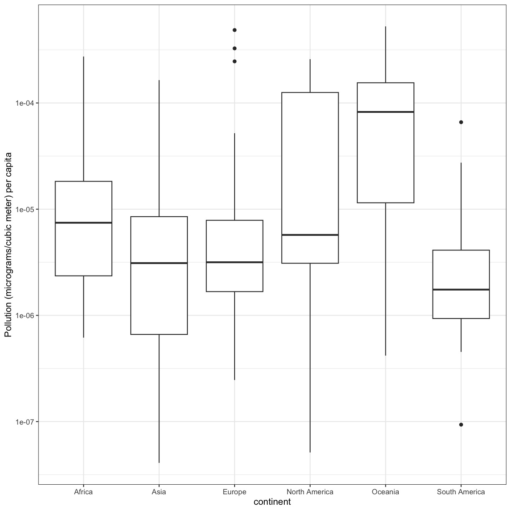

---
# Please do not edit this file directly; it is auto generated.
# Instead, please edit 04-r-data-analysis.md in _episodes_rmd/
title: "R for Data Analysis"
source: Rmd
teaching: 75
exercises: 15
questions:
- "How can I summarize my data in R?"
- "How can R help make my research more reproducible?"
objectives:
- "To become familiar with the functions of the `dplyr` and `tidyr` packages."
- "To be able to create plots and summary tables to answer analysis questions."
keypoints:
- "Package loading is an important first step in preparing an R environment."
- "There are many useful functions in the `tidyverse` packages that can aid in data analysis."
---

### Contents

1. [Day 2 review](#day-2-review)
1. [Overview of the lesson](#overview-of-the-lesson)
1. [Plotting for exploratory data analysis](#plotting-for-exploratory-data-analysis)
1. [Get stats fast with `summarize()`](#get-stats-fast-with-summarize)
1. [Calculating percentages](#calculate-percentages)
1. [Changing the shape of the data](#changing-the-shape-of-the-data)
1. [Plotting wide data](#plotting-wide-data)
1. [Applying it to your own data](#applying-it-to-your-own-data)

# Day 2 review

Yesterday we learned all about data cleaning, but we didn't cover everything. 

1. Make a list of what we learned yesterday related to data cleaning.
1. Make a list of things we didn't learn yesterday that you sometimes have to do while data cleaning.
1. Choose one item from the list of things we didn't learn and use the Internet to search for a way to do it using the `tidyverse`. 

# Overview of the lesson

So far, you've learned how to load, plot, merge, and clean data. In the process, you've learned a lot of new functions which are useful for transforming data. Today, we are going to put all those new skills you learned together and learn a few new functions that will be really helpful for exploratory data analysis. We'll start with a few examples of how plotting can be a really useful tool for exploratory data analysis. Then, we'll learn a function that will help us get summary statistics for our data and compare those summary statistics to plots. We'll also learn how to calculate proportions and percentages. Finally, we'll learn how to change the shape of data to make certain analyses more straight forward. First, let's read in the data on smoking, lung cancer rates, and pollution that we generated yesterday:

~~~
library(tidyverse) 
~~~
{: .language-r}

~~~
── Attaching packages ─────────────────────────────────────── tidyverse 1.3.0 ──
~~~
{: .output}

~~~
✔ ggplot2 3.3.6     ✔ purrr   0.3.4
✔ tibble  3.1.7     ✔ dplyr   1.0.9
✔ tidyr   1.2.0     ✔ stringr 1.4.0
✔ readr   2.1.2     ✔ forcats 1.0.0
~~~
{: .output}

~~~
── Conflicts ────────────────────────────────────────── tidyverse_conflicts() ──
✖ dplyr::filter() masks stats::filter()
✖ dplyr::lag()    masks stats::lag()
~~~
{: .output}

~~~
smoking_pollution <- read_csv("data/smoking_pollution.csv")
~~~
{: .language-r}

~~~
Rows: 191 Columns: 7
~~~
{: .output}

~~~
── Column specification ────────────────────────────────────────────────────────
Delimiter: ","
chr (2): country, continent
dbl (5): year, pop, smoke_pct, lung_cancer_pct, pollution

ℹ Use `spec()` to retrieve the full column specification for this data.
ℹ Specify the column types or set `show_col_types = FALSE` to quiet this message.
~~~
{: .output}

# Plotting for exploratory data analysis

[*Back to top*](#contents)

For our analysis, we have three questions we'd like to answer: 

1. Is there a relationship between population and ambient pollution levels (in micrograms per cubic meter)?
1. Which continent has the highest pollution levels per capita?
1. Is there a relationship between ambient pollution levels per capita and lung cancer rates?

**1) Is there a relationship between population and ambient pollution levels (in micrograms per cubic meter)?**

To answer this question, we'll plot ambient pollution levels against population using a scatter plot. It will help to scale the x axis (population) log 10.

~~~
smoking_pollution %>%
  ggplot(aes(x = pop, y = pollution)) +
  geom_point() +
  scale_x_log10() +
  labs(x = "Population", y = "Ambient pollution levels (micrograms/cubic meter)", 
       size = "Population\n(millions)") +
  theme_bw()
~~~
{: .language-r}

We observe a positive association between ambient pollution levels and population.

To help clarify the association, we can add a fit line through the data using `geom_smooth(method = "lm")`. Notice we added the `method = "lm"` argument. This tells `geom_smooth()` that we would like a linear model (lm) fit to the data.

~~~
smoking_pollution %>%
  ggplot(aes(x = pop, y = pollution)) +
  geom_point() +
  geom_smooth(method = "lm") +
  scale_x_log10() +
  labs(x = "Population", y = "Ambient pollution levels (micrograms/cubic meter)", size = "Population\n(millions)") +
  theme_bw() 
~~~
{: .language-r}

~~~
`geom_smooth()` using formula 'y ~ x'
~~~
{: .output}

To answer our first question, we observe a positive association between population and ambient pollution. In other words, countries with higher populations tend to have higher ambient pollution levels. It is very important to remember that associations are not indicative of causality and there could be confounding variables that may be playing into this apparent relationship. Can you think of any confounding factors we haven't accoutned for?

> ## Challenge: 2) which continent has the highest pollution levels per capita?
> To answer this question, we need to calculate the pollution levels per capita for each country using `mutate()`. Then plot a boxplot to look at these levels by continent. *Hint: it may help to scale the y axis log10*
> 
> > ## Solution: 
> > 
> > ~~~
> > smoking_pollution %>%
> >   mutate(pollution_capita = pollution/pop) %>%
> >   ggplot(aes(x = continent, y = pollution_capita)) +
> >   geom_boxplot() +
> >   scale_y_log10() +
> >   labs(y = "Pollution (micrograms/cubic meter) per capita")+
> >   theme_bw()
> > ~~~
> > {: .language-r}
> > 
> > 
> > Which continent has the highest pollution levels per capita? What other factors do you think could be driving this observation?
> {: .solution}
{: .challenge}

> ## Challenge: 3) Is there a relationship between ambient pollution levels per capita and lung cancer rates?
> To answer this question, let's make a scatter plot with ambient pollution levels on the x axis and lung cancer rates on the y axis. *Hint: Make sure to scale the x-axis log10.*
> 
> > ## Solution: 
> > 
> > ~~~
> > smoking_pollution %>%
> >   mutate(pollution_capita = pollution/pop) %>%
> >   ggplot(aes(x = pollution_capita, y = lung_cancer_pct)) +
> >   geom_point() +
> >   scale_x_log10() +
> >   labs(x = "Pollution (micrograms/cubic meter) per capita", y = "Percent of people with lung cancer")+
> >   theme_bw()
> > ~~~
> > {: .language-r}
> > 
> > 
> > There does not appear to be a direct relationship between pollution and lung cancer rates. 
> {: .solution}
{: .challenge}

## Get stats fast with `summarize()` {#get-stats-fast-with-summarize}
[*Back to top*](#contents)

Let's say we would like to know the mean (average) smoking rate in the dataset. R has a built in function function called `mean()` that will calculate this value for us. We can apply that function to our smoke_pct column using the `summarize()` function. Here's what that looks like:

~~~
smoking_pollution %>%
    summarise(mean_smoke_pct = mean(smoke_pct))
~~~
{: .language-r}

~~~
# A tibble: 1 × 1
  mean_smoke_pct
           <dbl>
1           23.9
~~~
{: .output}

When we call `summarize()`, we can use any of the column names of our data object as values to pass to other functions. `summarize()` will return a new data object and our value will be returned as a column.

> **Note:** The `summarize()` and `summarise()` functions perform identical functions.

The `mean_smoke_pct=` part tells `summarize()` to use "mean_smoke_pct" as the name of the new column. Note that you don't have to have quotes around this new name as long as it starts with a letter and doesn't include a space.

When you call `summarize()`, you can also create more than one new column. To do so, you must separate your columns with a comma. Building on the code from above, let's add a new column that calculates the minimum and maximum percent of smokers. 

~~~
smoking_pollution %>%
  summarize(mean_smoke_pct=mean(smoke_pct),
            min_smoke_pct=min(smoke_pct),
            max_smoke_pct=max(smoke_pct))
~~~
{: .language-r}

~~~
# A tibble: 1 × 3
  mean_smoke_pct min_smoke_pct max_smoke_pct
           <dbl>         <dbl>         <dbl>
1           23.9          3.12          46.9
~~~
{: .output}

Perhaps one of the most powerful ways to use `summarise()` is to combine it with `group_by()`. This enables you to calculate summary statistics for specific groups. For example, suppose we wanted to calculate the the mean, min, and max `smoke_pct` for each continent. How would you modify the code above?

~~~
smoking_pollution %>%
    group_by(continent) %>%
    summarize(mean_smoke_pct=mean(smoke_pct),
            min_smoke_pct=min(smoke_pct),
            max_smoke_pct=max(smoke_pct))
~~~
{: .language-r}

~~~
# A tibble: 6 × 4
  continent     mean_smoke_pct min_smoke_pct max_smoke_pct
  <chr>                  <dbl>         <dbl>         <dbl>
1 Africa                  15.0          3.81          31.9
2 Asia                    25.1          3.12          39.7
3 Europe                  34.2         21.8           46.1
4 North America           16.1          6.55          33.1
5 Oceania                 33.3         21.2           46.9
6 South America           24.4          8.33          39.5
~~~
{: .output}

> ## Exercise: Summary stats and boxplots
>
>  Part 1: Use `group_by()` and `summarise()` to find the median, min, max, and interquartile range of `lung_cancer_pct` for each continent. 
>
> Part 2: Make a box plot of `pollution` on the y axis and continent on the x axis. Compare your plot to your table. What do you notice? Which do you think is easier to interpret?
>
> > ## Solution
> >
> > Part 1: Use `group_by()` and `summarise()` to find the median, min, max, and interquartile range of `pollution` for each continent.
> >
> > 
> > ~~~
> > smoking_pollution %>%
> >   group_by(continent) %>%
> >   summarise(med_pollution = median(pollution),
> > min_pollution = min(pollution),
> > max_pollution = max(pollution),
> > iqr_pollution = IQR(pollution)) 
> > ~~~
> > {: .language-r}
> > 
> > 
> > 
> > ~~~
> > # A tibble: 6 × 5
> >   continent     med_pollution min_pollution max_pollution iqr_pollution
> >   <chr>                 <dbl>         <dbl>         <dbl>         <dbl>
> > 1 Africa                35.7          14.2           70.6         24.1 
> > 2 Asia                  29.4           7.63          78.2         22.4 
> > 3 Europe                19.6           6.81          43.7          9.69
> > 4 North America         18.5           8.14          38.1          4.64
> > 5 Oceania                8.05          4.69          14.3          2.45
> > 6 South America         20.2           9.97          45.3         12.2 
> > ~~~
> > {: .output}
> >
> > Part 2: Make a box plot of `pollution` on the y axis and continent on the x axis. Compare your plot to your table. What do you notice?
> >
> > 
> > ~~~
> > smoking_pollution %>%
> >     ggplot(aes(x = continent, y = pollution)) +
> >     geom_boxplot()
> > ~~~
> > {: .language-r}
> > 
> > 
> > 
> > When comparing your table to your plot, you'll notice that the dark horizontal lines represent median values. The boxes have lengths equal to the interquartile range (IQR). And the highest and lowest values for each continent match the table as well. The plot makes it easier to see differences between continents. The table provides finer details for comparison. What you choose to report will depend on whether you want to bring attention to those finer details or whether you want to discuss overall trends.
> >
> {: .solution}
{: .challenge}

# Calculating percentages {#calculate-percentages}
[*Back to top*](#contents)

Finding percentages using `dplyr` can be a little bit complicated. However, it's a very useful skill! We've included an exercise here that provides an example for how to caluclate percentages.

> ## Percentages
> What percentage of the global population in 1990 did Africa make up? What percentage of the population in Africa did Kenya make up? 
>
> > ## Solution
> >
> > Create a new variable using `group_by()` and `mutate()` that calculates percentages for the pop variable.
> >
> > 
> > ~~~
> > smoking_pollution %>%
> >   mutate(total_pop = sum(pop)) %>% #total_pop is the global population
> >   group_by(continent) %>%  #grouping by continent allows us to calculate the population on each continent
> >   mutate(cont_pop = sum(pop), #cont_pop is the continental population
> >          cont_percent = cont_pop/total_pop * 100, #cont_percent is the percent of the global population for the continent
> >          country_cont_pct = pop/cont_pop * 100) %>% #country_cont_pct is the percent of the continent population for a given country
> >   select(country, continent, cont_percent, country_cont_pct) %>%
> >   filter(country == "Kenya")
> > ~~~
> > {: .language-r}
> > 
> > 
> > 
> > ~~~
> > # A tibble: 1 × 4
> > # Groups:   continent [1]
> >   country continent cont_percent country_cont_pct
> >   <chr>   <chr>            <dbl>            <dbl>
> > 1 Kenya   Africa            12.1             3.77
> > ~~~
> > {: .output}
> >
> > This table shows that Kenya makes up 4% of the population of Africa, and Africa makes up 12% of the global population. 
> {: .solution}
{: .challenge}

## Changing the shape of the data

[*Back to top*](#contents)

Data comes in many shapes and sizes, and one way we classify data is either "wide" or "long." Data that is "long" has one row per observation. The `smoking` data is in a long format. We have one row for each country for each year and each different measurement for that country is in a different column. We might describe this data as "tidy" because it makes it easy to work with `ggplot2` and `dplyr` functions (this is where the "tidy" in "tidyverse" comes from). As tidy as it may be, sometimes we may want our data in a "wide" format. Typically in "wide" format each row represents a group of observations and each value is placed in a different column rather than a different row. For example, let's read in a smoking and lung cancer data set that covers many years and take a look at it:

~~~
smoking_cancer <- read_csv("data/smoking_cancer.csv")
~~~
{: .language-r}

~~~
Rows: 5719 Columns: 6
── Column specification ────────────────────────────────────────────────────────
Delimiter: ","
chr (2): country, continent
dbl (4): year, pop, smoke_pct, lung_cancer_pct

ℹ Use `spec()` to retrieve the full column specification for this data.
ℹ Specify the column types or set `show_col_types = FALSE` to quiet this message.
~~~
{: .output}

It has one row for each country for each year the data were collected. But maybe we want only one row per country and want to spread the percent of smokers values into different columns (one for each year).

The `tidyr` package contains the functions `pivot_wider()` and `pivot_longer()` that make it easy to switch between the two formats. The `tidyr` package is included in the `tidyverse` package so we don't need to do anything to load it.

Let's create a wide version of our data using `pivot_wider()`:

~~~
smoking_cancer %>%
  group_by(country, continent, year) %>% 
  summarize(smoke_pct = mean(smoke_pct)) %>%
  pivot_wider(names_from = year, values_from = smoke_pct)
~~~
{: .language-r}

~~~
`summarise()` has grouped output by 'country', 'continent'. You can override
using the `.groups` argument.
~~~
{: .output}

~~~
# A tibble: 191 × 32
# Groups:   country, continent [191]
   country     continent `1990` `1991` `1992` `1993` `1994` `1995` `1996` `1997`
   <chr>       <chr>      <dbl>  <dbl>  <dbl>  <dbl>  <dbl>  <dbl>  <dbl>  <dbl>
 1 Afghanistan Asia        3.12   3.29   3.53   3.77   4.00   4.25   4.53   4.82
 2 Albania     Europe     24.2   24.1   24.0   24.0   23.9   23.8   23.8   23.9 
 3 Algeria     Africa     18.9   18.7   18.6   18.4   18.2   18.0   17.8   17.6 
 4 Andorra     Europe     36.6   36.5   36.3   36.2   35.9   35.5   35.2   34.9 
 5 Angola      Africa     12.5   12.4   12.2   12.0   11.8   11.5   11.3   11.0 
 6 Antigua an… North Am…   6.80   6.94   7.06   7.17   7.27   7.36   7.43   7.47
 7 Argentina   South Am…  30.4   30.1   29.9   29.7   29.5   29.4   29.2   29.1 
 8 Armenia     Europe     30.5   30.4   30.2   30.0   29.9   29.7   29.6   29.5 
 9 Australia   Oceania    29.3   28.8   28.4   27.9   27.5   27.0   26.4   25.9 
10 Austria     Europe     35.4   35.8   36.2   36.6   37.0   37.4   37.8   38.1 
# … with 181 more rows, and 22 more variables: `1998` <dbl>, `1999` <dbl>,
#   `2000` <dbl>, `2001` <dbl>, `2002` <dbl>, `2003` <dbl>, `2004` <dbl>,
#   `2005` <dbl>, `2006` <dbl>, `2007` <dbl>, `2008` <dbl>, `2009` <dbl>,
#   `2010` <dbl>, `2011` <dbl>, `2012` <dbl>, `2013` <dbl>, `2014` <dbl>,
#   `2015` <dbl>, `2016` <dbl>, `2017` <dbl>, `2018` <dbl>, `2019` <dbl>
~~~
{: .output}

Notice here that we tell `pivot_wider()` which columns to pull the names we wish our new columns to be named from the year variable, and the values to populate those columns from the `smoke_pct` variable. (Again, neither of which have to be in quotes in the code when there are no special characters or spaces - certainly an incentive not to use special characters or spaces!) We see that the resulting table has new columns by year, and the values populate it with our remaining variables dictating the rows.

## Plotting wide data

Let's make a plot with our wide data comparing percent of smokers in 1990 to percent of smokers in 2010 to see how it has changed for each country.

~~~
smoking_cancer %>%
  group_by(country, continent, year) %>% 
  summarize(smoke_pct = mean(smoke_pct)) %>%
  pivot_wider(names_from = year, values_from = smoke_pct) %>% 
  ggplot(aes(x = 1990, y = 2010)) +
  geom_point()
~~~
{: .language-r}

~~~
`summarise()` has grouped output by 'country', 'continent'. You can override
using the `.groups` argument.
~~~
{: .output}

Hmm that's not what we want. `ggplot` just plotted the numbers 1990 and 2010 instead of the data from the years. That's because it evaluates those as numbers instead of column names. To fix this, we can add a prefix to the years in `pivot_wider()`:

~~~
smoking_cancer %>%
  group_by(country, continent, year) %>% 
  summarize(smoke_pct = mean(smoke_pct)) %>%
  pivot_wider(names_from = year, values_from = smoke_pct, names_prefix = 'y') %>% 
  ggplot(aes(x = y1990, y = y2010)) +
  geom_point()
~~~
{: .language-r}

~~~
`summarise()` has grouped output by 'country', 'continent'. You can override
using the `.groups` argument.
~~~
{: .output}

Alright, now we have a plot with the mean percent of smokers in in 1990 on the x axis and the mean percent of smokers in 2010 on the y axis, and each point represents a country. However, the different ranges on the x and y axis make it hard to compare the points. 
Let's fix that by adding a line at y=x. 

~~~
smoking_cancer %>%
  group_by(country, continent, year) %>% 
  summarize(smoke_pct = mean(smoke_pct)) %>%
  pivot_wider(names_from = year, values_from = smoke_pct, names_prefix = 'y') %>% 
  ggplot(aes(x = y1990, y = y2010)) +
  geom_point() +
  geom_abline(intercept = 0, slope = 1)
~~~
{: .language-r}

~~~
`summarise()` has grouped output by 'country', 'continent'. You can override
using the `.groups` argument.
~~~
{: .output}

It seems like in most countries the percent of smokers has decreased from 1990 to 2010, since most of the points fall below the line y = x. However, there are some countries where smoking has increased (i.e. the points are above the line y = x). Let's figure out which those are!

> ## Bonus: Identifying countries with more smokers in 2010 than 1990
>
> Use what you've learned from today to figure out which countries had higher smoking percentage in 2010 than 1990. 
>
> Bonus: Order the data frame from greatest to smallest difference. HINT: The `arrange()` function can help you do this. 
> 
> > ## Solution
> > 
> > ~~~
> > smoking_cancer %>%
> >   group_by(country, continent, year) %>% # group by the columns you want to keep
> >   summarize(smoke_pct = mean(smoke_pct)) %>% # summarize to get one value per country per year
> >   pivot_wider(names_from = year, values_from = smoke_pct, names_prefix = 'y') %>% # pivot wider
> >   mutate(diff = y2010 - y1990) %>% # find the difference between the years of interest
> >   select(country, continent, diff) %>% # select the columns of interest
> >   filter(diff > 0) %>% # filter to ones where the difference is greater than zero
> >   arrange(-diff) # bonus - arrange by diff, highest to lowest
> > ~~~
> > {: .language-r}
> > 
> > 
> > 
> > ~~~
> > `summarise()` has grouped output by 'country', 'continent'. You can override
> > using the `.groups` argument.
> > ~~~
> > {: .output}
> > 
> > 
> > 
> > ~~~
> > # A tibble: 42 × 3
> > # Groups:   country, continent [42]
> >    country                continent  diff
> >    <chr>                  <chr>     <dbl>
> >  1 Bosnia and Herzegovina Europe     9.33
> >  2 Lebanon                Asia       7.91
> >  3 Afghanistan            Asia       6.08
> >  4 Albania                Europe     5.23
> >  5 Indonesia              Asia       5.07
> >  6 Saudi Arabia           Asia       4.21
> >  7 Uzbekistan             Asia       4.04
> >  8 Kiribati               Oceania    3.68
> >  9 Mali                   Africa     3.03
> > 10 Djibouti               Africa     2.83
> > # … with 32 more rows
> > ~~~
> > {: .output}
> {: .solution}
{: .challenge}

# Bonus: correlation

Let's go back to the very first question we talked about today: Is there a relationship between population and ambient pollution levels (in micrograms per cubic meter)? In addition to making a scatterplot, another way to get at this question is by calculating a _correlation coefficient_. We will cover two correlation coefficients here: Pearson's (which assumes a linear relationship) and Spearman's (which doesn't assume a linear relationship).

There is a function in base R that calculates correlation coefficients (`cor()`), but is kind of hard to use with the tidy way that we're used to doing things. So we're going to download another package that's part of the `tidyverse`, but not the core set of packages that we downloaded originally, called `corrr` (that's not a typo - there are actually 3 r's at the end). This package has a function called `correlate()` that makes it easy to find correlations between variables. 

Take the following steps to calculate the Pearson and Spearman correlations between population and ambient pollution levels:

1. Install and load the `corrr` package.
1. Subset `smoking_pollution` to the population and ambient pollution level columns.
1. Find the Pearson correlation between smoking and pollution using the `correlate()` function from the `corrr` package.
1. Find the Spearman correlation between smoking and pollution using the `correlate()` function from the `corrr` package.

> > ## Solution
> > 
> > ~~~
> > # install.packages(corrr) # only run this once
> > library(corrr)
> > ~~~
> > {: .language-r}
> > 
> > 
> > 
> > ~~~
> > Error in library(corrr): there is no package called 'corrr'
> > ~~~
> > {: .error}
> > 
> > 
> > 
> > ~~~
> > smoking_pollution %>%
> >   select(pop, pollution) %>%
> >   correlate(method = 'pearson')
> > ~~~
> > {: .language-r}
> > 
> > 
> > 
> > ~~~
> > Error in correlate(., method = "pearson"): could not find function "correlate"
> > ~~~
> > {: .error}
> > 
> > 
> > 
> > ~~~
> > smoking_pollution %>%
> >   select(pop, pollution) %>%
> >   correlate(method = 'spearman')
> > ~~~
> > {: .language-r}
> > 
> > 
> > 
> > ~~~
> > Error in correlate(., method = "spearman"): could not find function "correlate"
> > ~~~
> > {: .error}
> {: .solution}
{: .challenge}

# Applying it to your own data

Continue working on your project. Now you can generate some summary statistics as well!
