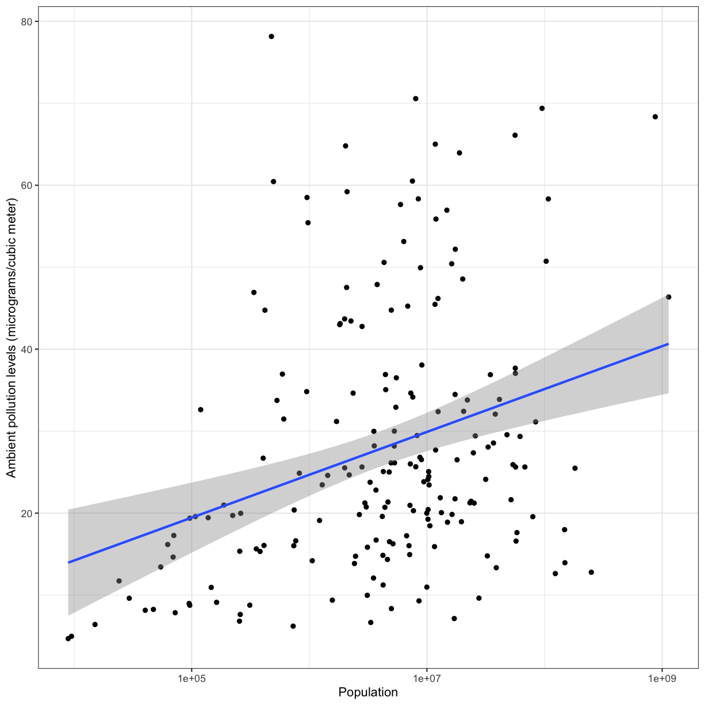
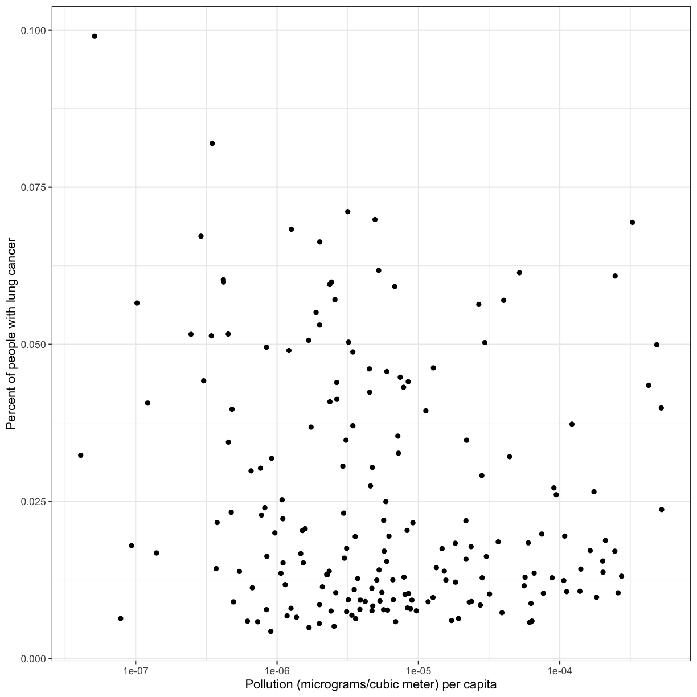

---
# Please do not edit this file directly; it is auto generated.
# Instead, please edit 04-r-data-cleaning-merging.md in _episodes_rmd/
title: "R for Data Cleaning and Merging"
source: Rmd
teaching: 75
exercises: 15
questions:
- "How can I combine two datasets from different sources?"
- "How can data tidying facilitate answering analysis questions?"
objectives:
- "To become familiar with more functions of the `dplyr` and `tidyr` packages."
- "To be able to use `dplyr` and `tidyr` to prepare data for analysis."
- "To be able to combine two different data sources using joins."
keypoints:
- "Assessing data source and structure is an important first step in analysis."
- "Data analysis in R facilitates reproducible research."
- "Preparing data for analysis can take significant effort and planning."
---

### Contents

1.  [Cleaning up data](#cleaning-up-data)
1.  [Joining data frames](#joining-data-frames)
1.  [Analyzing combined data](#analyzing-combined-data)

# Cleaning up data

[*Back to top*](#contents)

Researchers are often pulling data from several sources, and the process of making data compatible with one another and prepared for analysis can be a large undertaking. Luckily, there are many functions that allow us to do this in R. We've been working with the Global Burden of Disease (GBD 2019) dataset, which contains population, smoking rates, and lung cancer rates by year. In this section, we practice cleaning and preparing a second dataset containing ambient pollution data by location and year, also sourced from [the GBD 2019](https://ghdx.healthdata.org/record/global-burden-disease-study-2019-gbd-2019-air-pollution-exposure-estimates-1990-2019).

It's always good to go into data cleaning with a clear goal in mind. Here, we'd like to prepare the ambient pollution data to be compatible with our lung cancer data so we can directly compare lung cancer rates to ambient pollution levels. To make this work, we'd like a data frame that contains columns with the country name, year, and median ambient pollution levels (in micrograms per cubic meter). We will make this comparison for the most recent year in these datasets, 2019. Let's start with reading the data in using `read_csv()`.

~~~
read_csv("data/ambient_pollution.csv")
~~~
{: .language-r}

~~~
Rows: 9660 Columns: 3
── Column specification ────────────────────────────────────────────────────────
Delimiter: ","
chr (1): location_name
dbl (2): year_id, median

ℹ Use `spec()` to retrieve the full column specification for this data.
ℹ Specify the column types or set `show_col_types = FALSE` to quiet this message.
~~~
{: .output}

~~~
# A tibble: 9,660 × 3
   location_name year_id median
   <chr>           <dbl>  <dbl>
 1 Global           1990   40.0
 2 Global           1995   38.9
 3 Global           2000   40.6
 4 Global           2005   40.6
 5 Global           2010   42.7
 6 Global           2011   44.4
 7 Global           2012   46.1
 8 Global           2013   47.1
 9 Global           2014   47.3
10 Global           2015   46.1
# … with 9,650 more rows
~~~
{: .output}

It looks like our data object has three columns: `location_name`, `year_id`, and `median`. Scroll through the data object to get an idea of what's there. Can you think of anything we might need to take care of in order to merge these data with our lung cancer rates dataset? It looks like the `location_name` column contains values other than countries, and our `year_id` column has many years, and we are only interested in 2019 for now.

Let's save this dataframe to `ambient_pollution_dirty` so that we don't have to read it in every time we want to clean it.

~~~
ambient_pollution_dirty <- read_csv("data/ambient_pollution.csv")
~~~
{: .language-r}

~~~
Rows: 9660 Columns: 3
── Column specification ────────────────────────────────────────────────────────
Delimiter: ","
chr (1): location_name
dbl (2): year_id, median

ℹ Use `spec()` to retrieve the full column specification for this data.
ℹ Specify the column types or set `show_col_types = FALSE` to quiet this message.
~~~
{: .output}

~~~
ambient_pollution_dirty
~~~
{: .language-r}

~~~
# A tibble: 9,660 × 3
   location_name year_id median
   <chr>           <dbl>  <dbl>
 1 Global           1990   40.0
 2 Global           1995   38.9
 3 Global           2000   40.6
 4 Global           2005   40.6
 5 Global           2010   42.7
 6 Global           2011   44.4
 7 Global           2012   46.1
 8 Global           2013   47.1
 9 Global           2014   47.3
10 Global           2015   46.1
# … with 9,650 more rows
~~~
{: .output}

Alright, before we start changing anything about our dataset, it can be helpful to get a better idea of what we are looking at. For example, it's helpful to use `count()` to get an idea of how many observations we have for particular values in a column. Note: the function `count()` is a useful shortcut for `summarize(n = n())`. Let's start by looking at how many entries we have for each year in the dataset. This will also help us determine whether we have data for the year 2019, which is what we are looking for.

~~~
ambient_pollution_dirty %>%
  group_by(year_id) %>%
  count()
~~~
{: .language-r}

~~~
# A tibble: 14 × 2
# Groups:   year_id [14]
   year_id     n
     <dbl> <int>
 1    1990   690
 2    1995   690
 3    2000   690
 4    2005   690
 5    2010   690
 6    2011   690
 7    2012   690
 8    2013   690
 9    2014   690
10    2015   690
11    2016   690
12    2017   690
13    2018   690
14    2019   690
~~~
{: .output}

This output tells us two useful things: (1) for which years we have data, and (2) how many observations we have for each year. The summary data has 14 rows, which means there are 14 different years in which the pollution data was collected between 1990 and 2019. If you scroll to the end, you can see that we have 690 entries for 2019, which is excellent, since that's the year we are most interested in. It also looks like the number of observations is consistently 690 for each year that we have pollution measurements. 

We previously saw how we can subset rows from a data frame using `filter()`. Let's subset out the rows we are interested in, namely those from 2019. We can also drop the `year_id` column, since we know these data are only from 2019. Let's store the resulting dataset in an object named `pollution_2019_dirty`.

~~~
pollution_2019_dirty <- ambient_pollution_dirty %>%
  filter(year_id == 2019) %>%
  select(-year_id)
~~~
{: .language-r}

Notice that this data object has 690 rows, as we expect from our previous data summary.

Sometimes it can be helpful to explore your data summaries in the view tab. Try it in the exercise below.

> ## Viewing data summaries
> Count the number of observations for each unique `location_name` in `pollution_2019_dirty` and use the *pipe operator* and `view()` to explore the summary data. Click on the column names to reorder the summary data however you'd like. Do you notice anything interesting?
> 
> > ## Solution: 
> > 
> > ~~~
> > pollution_2019_dirty %>%
> >   group_by(location_name) %>%
> >   count() %>%
> >   view()
> > ~~~
> > {: .language-r}
> > There are a couple things to notice. First, the summary data only has 685 rows, even though there were 690 observations for each year. This suggests that there may be multiple measurements for some location_name values. Second, if you click on the `n` column to sort in descending order, you can see that there are five location_name values for which we have 2 observations instead of 1. This is good to know as we continue to learn more about our datset.
> {: .solution}
{: .challenge}

> ## Bonus: sorting columns
> We just used the view tab to sort our count data, but how could you use code to sort the `n` column?
> 
> > ## Solution: 
> > 
> > ~~~
> > pollution_2019_dirty %>%
> >   group_by(location_name) %>%
> >   count() %>% 
> >   arrange(desc(n)) %>%
> >   view()
> > ~~~
> > {: .language-r}
> > The `arrange()` function is very helpful for sorting data objects based on one or more columns. Notice we also included the function `desc()`, which tells `arrange()` to sort in descending order (largest to smallest).
> {: .solution}
{: .challenge}

Another helpful thing to do when exploring and cleaning a new dataset is to get an idea of whether there are any missing values or duplicate rows. Let's start by checking to see if we have any **missing data**. We will do this using `drop_na()`, a tidyverse function that removes any rows that have missing values. We will then check the number of rows using `nrow` in our dataset and compare to the original to see if we lost any rows with missing data.

~~~
pollution_2019_dirty %>%
  drop_na() %>%
  nrow()
~~~
{: .language-r}

~~~
[1] 690
~~~
{: .output}

After dropping rows with missing values, our data object still has the same number of rows (690) as `pollution_2019_dirty`. This tells us that we don't have any rows with missing data. Wow! We're pretty lucky, because often datasets DO have missing data. Later on, we will learn how to identify observations with missing values.

Now, let's check to see if our dataset contains *duplicate rows*. We already know that we have some rows with identical location names, but are the rows identical? We can use the `distinct()` function, which removes any rows for which all values are duplicates of another row, followed by `nrow()` to find out:

~~~
pollution_2019_dirty %>%
  distinct() %>%
  nrow()
~~~
{: .language-r}

~~~
[1] 688
~~~
{: .output}
You can see that after applying the `distinct()` function, our dataset only has 688 rows. This tells us that there are two rows that were exactly identical to other rows in our dataset. However, we identified 5 entries with more than one row, suggesting that some countries have multiple entries with different values. It's important to check these out because they might indicate issues with data entry or discordant data.

> ## Exercise: Filtering for duplicate data
> Filter `pollution_2019_dirty` only to rows which have duplicate values in the `location_name` column. *Hint: try using `group_by()` and `mutate()` to count the number of rows for each `location_name`.* 
> 
> > ## Solution: 
> > 
> > ~~~
> > pollution_2019_dirty %>%
> >   group_by(location_name) %>%
> >   mutate( n = n()) %>%
> >   filter(n > 1) %>%
> >   arrange(location_name)
> > ~~~
> > {: .language-r}
> > 
> > 
> > 
> > ~~~
> > # A tibble: 10 × 3
> > # Groups:   location_name [5]
> >    location_name                median     n
> >    <chr>                         <dbl> <int>
> >  1 Georgia                       17.6      2
> >  2 Georgia                        8.51     2
> >  3 North Africa and Middle East  43.5      2
> >  4 North Africa and Middle East  43.5      2
> >  5 South Asia                    78.2      2
> >  6 South Asia                    78.2      2
> >  7 Stockholm                      4.74     2
> >  8 Stockholm                      5.48     2
> >  9 Sweden except Stockholm        4.02     2
> > 10 Sweden except Stockholm        5.69     2
> > ~~~
> > {: .output}
> > 
> > You can see that we get a data object with 10 entries, 2x5 location_names. Two of these location_names have identical rows, while the others have two different values, which presumably could have been measured at different times in 2019. In your own data, it's important to figure out why there are multiple entries, especially if they are very different, and whether you trust one more than the other. For our purposes, we will simply take the mean of the two values. 
> {: .solution}
{: .challenge}

Let's go ahead and take care of the location_names which have two different median pollution values by making a new column called `pollution` that is the mean. We can then remove the `median` column and store the resulting data object as `pollution_2019`.

~~~
pollution_2019 <- pollution_2019_dirty %>%
  group_by(location_name) %>%
  mutate(pollution = mean(median)) %>%
  select(-median) %>%
  distinct()
~~~
{: .language-r}

You can see that `pollution_2019` has 685 rows, as we expect, since we took care of the duplicated location_names.

Note: here, we took the mean to take care of duplicates and multiple entries, but this is not always the best way to do so. When working with your own data, make sure to think carefully about your dataset, what these multiple entries really mean, and whether you want to leave them as they are or take care of them in some different way.

> **Looking at your data:** You can get a look at your data-cleaning hard work by navigating to the **Environment** tab in RStudio and clicking the table icon next to the variable name. Notice when we do this, RStudio automatically runs the `View()` command. We've made a lot of progress!
{.callout}

# Joining data frames

[*Back to top*](#contents)

Now we're almost ready to join our pollution data to the smoking and lung cancer data. Previously we saw that we could read in and filter the smoking and lung cancer data to get the data from 2019 to create a new dataframe with our filtered data:

~~~
smoking_2019 <- read_csv("data/smoking_cancer.csv") %>%
  filter(year == 2019) %>%
  select(-year)
~~~
{: .language-r}

~~~
Rows: 5749 Columns: 6
── Column specification ────────────────────────────────────────────────────────
Delimiter: ","
chr (2): country, continent
dbl (4): year, pop, smoke_pct, lung_cancer_pct

ℹ Use `spec()` to retrieve the full column specification for this data.
ℹ Specify the column types or set `show_col_types = FALSE` to quiet this message.
~~~
{: .output}

Look at the data in `pollution_2019` and `smoking_2019`. If you had to merge these two data frames together, which columns would you use to merge them together? If you said `location_name` and `country`, you're right! But before we join the datasets, we need to make sure these columns are named the same thing.

> ## Review: Re-naming columns
> Rename the `location_name` column to `country` in the `pollution_2019` dataset. Go ahead and overwrite and store in the `pollution_2019` object
> 
> > ## Solution: 
> > 
> > ~~~
> > pollution_2019_clean <- pollution_2019 %>%
> >   rename(country = location_name) 
> > ~~~
> > {: .language-r}
> > 
> > Note that the column is labeled `country` even though it has values beyond the names of countries. We will take care of this later when we join datasets.
> {: .solution}
{: .challenge}

Because the column is now present in both datasets, we'll call `country` our "key". Now, when we join them together, can you think of any problems we might run into when we merge things? We might not have pollution data for all of the countries in the `smoking_2019` dataset and vice versa. Also, a country might be represented in both data frames but not by the same name in both places.

The dplyr package has a number of tools for joining data frames together depending on what we want to do with the rows of the data of countries that are not represented in both data frames. Here we'll be using `left_join()`. 

In a "left join", the new data frame only has those rows for the key values that are found in the first dataframe listed. This is a very commonly used join.

> ## Bonus: Other dplyr join functions 
>
> Outer joins and can be performed using `inner_join()`, `right_join()`, `full_join()`, and `anti_join()`. In a "left join", if the key is present in the left hand data frame, it will appear in the output, even if it is not found in the the right hand data frame. For a right join, the opposite is true. For a full join, all possible keys are included in the output data frame.
> 
> [Image source](https://tavareshugo.github.io/r-intro-tidyverse-gapminder/08-joins/index.html)
{: .solution}

Let's give the `left_join()` function a try. We will put our `smoking_2019` dataset on the left so that we maintain all of the rows we had in that dataset.

~~~
left_join(smoking_2019, pollution_2019_clean)
~~~
{: .language-r}

~~~
Joining, by = "country"
~~~
{: .output}

~~~
# A tibble: 191 × 6
   country         continent        pop smoke_pct lung_cancer_pct pollution
   <chr>           <chr>          <dbl>     <dbl>           <dbl>     <dbl>
 1 Myanmar         Asia        54045422      23.9          0.0225     29.3 
 2 China           Asia      1407745000      26.9          0.0590     47.7 
 3 Cambodia        Asia        16486542      21.5          0.0247     21.5 
 4 Philippines     Asia       108116622      24.7          0.0184     18.7 
 5 Maldives        Asia          530957      31.4          0.0102     10.8 
 6 Tonga           Oceania       104497      27.4          0.0281      9.55
 7 Vietnam         Asia        96462108      24.3          0.0302     NA   
 8 Indonesia       Asia       270625567      31.0          0.0232     19.3 
 9 Timor-Leste     Asia         1293120      35.0          0.0194     15.1 
10 Solomon Islands Oceania       669821      35.8          0.0334     11.5 
# … with 181 more rows
~~~
{: .output}

We now have data from both datasets joined together in the same dataframe. Notice that the number of rows here, 191, is the same as the number of rows in the `smoking_2019` dataset? One thing to note about the output is that `left_join()` tells us that that it joined by "country". We can make this explicit using the "by" argument in the join functions

~~~
left_join(smoking_2019, pollution_2019_clean, by="country")
~~~
{: .language-r}

~~~
# A tibble: 191 × 6
   country         continent        pop smoke_pct lung_cancer_pct pollution
   <chr>           <chr>          <dbl>     <dbl>           <dbl>     <dbl>
 1 Myanmar         Asia        54045422      23.9          0.0225     29.3 
 2 China           Asia      1407745000      26.9          0.0590     47.7 
 3 Cambodia        Asia        16486542      21.5          0.0247     21.5 
 4 Philippines     Asia       108116622      24.7          0.0184     18.7 
 5 Maldives        Asia          530957      31.4          0.0102     10.8 
 6 Tonga           Oceania       104497      27.4          0.0281      9.55
 7 Vietnam         Asia        96462108      24.3          0.0302     NA   
 8 Indonesia       Asia       270625567      31.0          0.0232     19.3 
 9 Timor-Leste     Asia         1293120      35.0          0.0194     15.1 
10 Solomon Islands Oceania       669821      35.8          0.0334     11.5 
# … with 181 more rows
~~~
{: .output}

Alright, let's explore this joined data a little bit. First, let's check for any missing values. We will start by using the `drop_na()` and `nrow()` functions as we did before to get an idea of how many rows have missing values.

~~~
left_join(smoking_2019, pollution_2019_clean, by="country") %>%
  drop_na() %>%
  nrow()
~~~
{: .language-r}

~~~
[1] 189
~~~
{: .output}
It looks like the dataframe has 189 rows after we drop any observations with missing values. This means there are two rows with missing values.

Note that since we used `left_join`, we expect all the data from the `smoking_2019` dataset to be there, so if we have missing values, they will be in the `pollution` column. We will look for rows with missing values in the `pollution` column using the `filter()` function and `is.na()`, which is helpful for identifying missing data

~~~
left_join(smoking_2019, pollution_2019_clean, by="country") %>%
  filter(is.na(pollution))
~~~
{: .language-r}

~~~
# A tibble: 2 × 6
  country         continent      pop smoke_pct lung_cancer_pct pollution
  <chr>           <chr>        <dbl>     <dbl>           <dbl>     <dbl>
1 Vietnam         Asia      96462108      24.3          0.0302        NA
2 Slovak Republic Europe     5454147      27.0          0.0610        NA
~~~
{: .output}

We can see that pollution data were missing for Vietnam and Slovak Republic. Note that we were execting two rows with missing values, and we found both of them! That's great news.

If we look at the `pollution_2019_clean` data with `View()` and sort by `country`, we can see that Vientam and Slovak Republic are called different things in the pollution_2019 dataframe. They're called "Viet Nam" and "Slovakia," respectively. Using `mutate()` and `recode()`, we can update the pollution_2019 data so that the country names for Vietnam and Slovak Republic match those in the smoking_2019 data.

~~~
pollution_2019_clean <- pollution_2019_clean %>%
  mutate(country = recode(country, "Viet Nam" = "Vietnam", "Slovakia" = "Slovak Republic"))
~~~
{: .language-r}

**IMPORTANT**: Here, we overwrote our `pollution_2019_clean` dataframe. In other words, we replaced the existing data object with a new one. This is generally NOT recommended practice, but is often needed when first performing exploratory data analysis as we are here. After you finish exploratory analysis, it's always a good idea to go back and clean up your code to avoid overwriting objects.

> ## Challenge: Cleaning up code
> How would you clean up your code to avoid overwriting `pollution_2019_clean` as we did above? *Hint: start with the pollution_2019 dataframe.*
> 
> > ## Solution: 
> > 
> > ~~~
> > pollution_2019_clean <- pollution_2019 %>%
> >   rename(country = location_name) %>%
> >   mutate(country = recode(country, "Viet Nam" = "Vietnam", "Slovakia" = "Slovak Republic"))
> > ~~~
> > {: .language-r}
> {: .solution}
{: .challenge}

Alright, now let's `left_join()` our dataframes again and filter for missing values to see how it looks.

~~~
left_join(smoking_2019, pollution_2019_clean, by="country") %>%
  filter(is.na(pollution))
~~~
{: .language-r}

~~~
# A tibble: 0 × 6
# … with 6 variables: country <chr>, continent <chr>, pop <dbl>,
#   smoke_pct <dbl>, lung_cancer_pct <dbl>, pollution <dbl>
~~~
{: .output}
Now you can see that we have an empty dataframe! That's great news; it means that we do not have any rows with missing pollution data.

Finally, let's use `left_join()` to create a new data frame:

~~~
smoking_pollution <- left_join(smoking_2019, pollution_2019_clean, by="country")
~~~
{: .language-r}

We have reached our data cleaning goal! One of the best aspects of doing all of these steps coded in R is that our efforts are reproducible, and the raw data is maintained. With good documentation of data cleaning and analysis steps, we could easily share our work with another researcher who would be able to repeat what we've done. However, it's also nice to have a saved `csv` copy of our clean data. That way we can access it later without needing to redo our data cleaning, and we can also share the cleaned data with collaborators. To save our dataframe, we'll use `write_csv()`. 

~~~
write_csv(smoking_pollution, "data/smoking_pollution.csv")
~~~
{: .language-r}

Great - Now we can move on to the analysis! 

# Analyzing combined data

[*Back to top*](#contents)

For our analysis, we have three questions we'd like to answer: (1) Is there a relationship between population and ambient pollution levels (in micrograms per cubic meter)?; (2) which continent has the highest pollution levels per capita?; and (3) Is there a relationship between ambient pollution levels per capita and lung cancer rates?

**1) Is there a relationship between population and ambient pollution levels (in micrograms per cubic meter)?**

To answer this question, we'll plot ambient pollution levels against population using a scatter plot. It will help to scale the x axis (population) log 10.

~~~
smoking_pollution %>%
  ggplot() +
  aes(x = pop, y = pollution) +
  geom_point() +
  scale_x_log10() +
  labs(x = "Population", y = "Ambient pollution levels (micrograms/cubic meter)", size = "Population\n(millions)") +
  theme_bw()
~~~
{: .language-r}

We observe a positive association between ambient pollution levels and population.

To help clarify the association, we can add a fit line through the data using `geom_smooth(method = "lm")`. Notice we added the `method = "lm"` argument. This tells `geom_smooth()` that we would like a linear model (lm) fit to the data.

~~~
smoking_pollution %>%
  ggplot() +
  aes(x = pop, y = pollution) +
  geom_point() +
  geom_smooth(method = "lm") +
  scale_x_log10() +
  labs(x = "Population", y = "Ambient pollution levels (micrograms/cubic meter)", size = "Population\n(millions)") +
  theme_bw()
~~~
{: .language-r}

~~~
`geom_smooth()` using formula 'y ~ x'
~~~
{: .output}

To answer our first question, we observe a positive association between population and ambient pollution. In other words, countries with higher populations tend to have higher ambient pollution levels. It is very important to remember that associations are not indicative of causality and there could be confounding variables that may be playing into this apparent relationship. Can you think of any confounding factors we haven't accoutned for?

> ## Challenge: 1) Is there a relationship between ambient pollution levels per capita and lung cancer rates?
> To answer this question, we need to calculate the pollution levels per capita for each country using `mutate()`. Then plot a boxplot to look at these levels by continent. *Hint: it may help to scale the y axis log10*
> 
> > ## Solution: 
> > 
> > ~~~
> > smoking_pollution %>%
> >   mutate(pollution_capita = pollution/pop) %>%
> >   ggplot() +
> >   aes(x = continent, y = pollution_capita) +
> >   geom_boxplot() +
> >   scale_y_log10() +
> >   labs(y = "Pollution (micrograms/cubic meter) per capita")+
> >   theme_bw()
> > ~~~
> > {: .language-r}
> > 
> > 
> > Which continent has the highest pollution levels per capita? What other factors do you think could be driving this observation?
> {: .solution}
{: .challenge}

> ## Challenge: 2) Which continent has the highest pollution levels per capita?
> To answer this question, let's make a scatter plot with ambient pollution levels on the x axis and lung cancer rates on the y axis. *Hint: Make sure to scale the x-axis log10.*
> 
> > ## Solution: 
> > 
> > ~~~
> > smoking_pollution %>%
> >   mutate(pollution_capita = pollution/pop) %>%
> >   ggplot() +
> >   aes(x = pollution_capita, y = lung_cancer_pct) +
> >   geom_point() +
> >   scale_x_log10() +
> >   labs(x = "Pollution (micrograms/cubic meter) per capita", y = "Percent of people with lung cancer")+
> >   theme_bw()
> > ~~~
> > {: .language-r}
> > 
> > 
> > There does not appear to be a direct relationship between pollution and lung cancer rates. 
> {: .solution}
{: .challenge}

# Calculating percentages
Finding percentages using `dplyr` can be a little bit complicated. However, it's a very useful skill! We've included an exercise here that provides an example for how to caluclate percentages.

## Bonus exercise

> ## Calculating percent
>
> What percentage of the global population does Africa make up? What percentage of the population in Africa does Kenya make up? 
>
> > ## Solution
> >
> > Create a new variable using `group_by()` and `mutate()` that calculates percentages for the pop variable.
> >
> > 
> > ~~~
> > smoking_pollution %>%
> >   mutate(total_pop = sum(pop)) %>% #total_pop is the global population
> >   group_by(continent) %>%  #grouping by continent allows us to calculate the population on each continent
> >   mutate(cont_pop = sum(pop), #cont_pop is the continental population
> >          cont_percent = cont_pop/total_pop * 100, #cont_percent is the percent of the global population for the continent
> >          country_cont_pct = pop/cont_pop * 100) %>% #country_cont_pct is the percent of the continent population for a given country
> >   select(country, continent, cont_percent, country_cont_pct) %>%
> >   filter(country == "Kenya")
> > ~~~
> > {: .language-r}
> > 
> > 
> > 
> > ~~~
> > # A tibble: 1 × 4
> > # Groups:   continent [1]
> >   country continent cont_percent country_cont_pct
> >   <chr>   <chr>            <dbl>            <dbl>
> > 1 Kenya   Africa            17.1             4.04
> > ~~~
> > {: .output}
> >
> > This table shows that Kenya makes up 4% of the population of Africa, and Africa makes up 17% of the global population. 
> {: .solution}
{: .challenge}

